# マイ漢字タウン つかいかた

## はじめに ― マイ<ruby>漢字<rp>（</rp><rt>かんじ</rt><rp>）</rp></ruby>タウンで できること

このページは、マイ漢字タウンを はじめて ひらく人のための つかいかたです。
画面の 絵と 見くらべながら、上から じゅんに 読んでください。

### どんな アプリか

<ruby>小学校<rt>しょうがっこう</rt></ruby>で ならう <ruby>漢字<rt>かんじ</rt></ruby> 1026字を、
4つの力で おぼえる アプリです。
4つの力とは「<ruby>読<rt>よ</rt></ruby>み」「<ruby>意味<rt>いみ</rt></ruby>」
「<ruby>書字<rt>しょじ</rt></ruby>（字の かたち）」
「<ruby>筆順<rt>ひつじゅん</rt></ruby>（書く じゅんばん）」の ことです。

1字ずつ「<ruby>音読<rt>おんどく</rt></ruby> →
<ruby>書<rt>か</rt></ruby>き<ruby>順<rt>じゅん</rt></ruby> → なぞる → テスト」の
じゅんに すすみます。
おぼえた字は、しばらく たつと また 出てきます。わすれたころに もう一度 出るので、
おぼえたことが のこります。

<ruby>漢字<rt>かんじ</rt></ruby>を おぼえると、じぶんの まちに 人が ふえて、
まちが 大きく なります。
まちづくりは おまけです。やらなくても、<ruby>学習<rt>がくしゅう</rt></ruby>は
さいごまで すすめられます。

先生が つかう しくみも 入っています。<ruby>漢字<rt>かんじ</rt></ruby>を えらんで
じぶんの ドリルを 作り、リンクや QRコードで <ruby>学級<rt>がっきゅう</rt></ruby>に
くばれます（下の「マイドリルを 作って くばる」を 見てください）。

### つかう<ruby>前<rp>（</rp><rt>まえ</rt><rp>）</rp></ruby>に <ruby>用意<rp>（</rp><rt>ようい</rt><rp>）</rp></ruby>するもの

ひらく前に、つぎの ものを たしかめてください。

- インターネットに つながる <ruby>学習用<rt>がくしゅうよう</rt></ruby>の <ruby>端末<rt>たんまつ</rt></ruby>（タブレット・パソコン・スマートフォン）
- ブラウザー。Chrome か Safari を おすすめします
- ひらく ばしょ（アドレス）は https://kanji-town.giga-school.com/ です
- インターネットは さいしょの 1回だけ ひつようです。2回目からは なくても つかえます
- <ruby>音読<rt>おんどく</rt></ruby>チャレンジを つかうときだけ、マイクの きょかが いります

アカウントの とうろくや ログインは いりません。
<ruby>名前<rt>なまえ</rt></ruby>・<ruby>出席番号<rt>しゅっせきばんごう</rt></ruby>・
メールアドレスを 入れる ところが、そもそも ありません。

<ruby>学習<rt>がくしゅう</rt></ruby>の <ruby>記録<rt>きろく</rt></ruby>は、その
<ruby>端末<rt>たんまつ</rt></ruby>の 中だけに のこります。<ruby>外<rt>そと</rt></ruby>へ
<ruby>送<rt>おく</rt></ruby>られません。
<ruby>音読<rt>おんどく</rt></ruby>チャレンジの <ruby>声<rt>こえ</rt></ruby>も、
ろくおんも ほぞんも そうしんも しません。
ドリルの やりとりも、あいだに サーバーを <ruby>通<rt>とお</rt></ruby>しません。

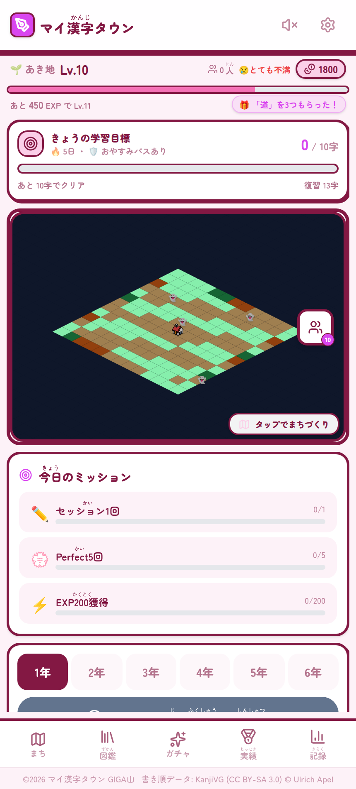

これが ホームの がめんです。

## さいしょに ひらいた日に すること

はじめて ひらいた日だけ、みじかい あんないと <ruby>学年<rt>がくねん</rt></ruby>えらびが あります。
2回目からは、いきなり ホームの<ruby>画面<rt>がめん</rt></ruby>が 出ます。

### あんないを <ruby>読<rp>（</rp><rt>よ</rt><rp>）</rp></ruby>む、または とばす

アプリを ひらくと、さいしょに あんないが 出ます。
「つぎへ」を おすと <ruby>先<rt>さき</rt></ruby>へ すすみ、「スキップする」を おすと とばせます。

とばしても、あとから こまることは ありません。
この つかいかたのページに 同じことが 書いてあります。

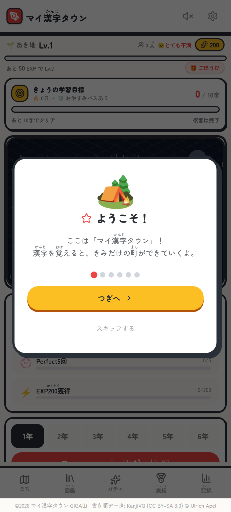

「スキップする」は 左下に あります。

### 学年を えらぶ

あんないが おわると、ホームの<ruby>画面<rt>がめん</rt></ruby>が 出ます。
まん中より 少し下に「1年」から「6年」の ボタンが ならんでいます。

えらびかた:

1. じぶんの <ruby>学年<rt>がくねん</rt></ruby>の ボタンを おします。
2. えらんだ <ruby>学年<rt>がくねん</rt></ruby>は すぐに ほぞんされます。「けってい」の ボタンは ありません。
3. すぐ下の 赤い 大きなボタンの 字数が、えらんだ <ruby>学年<rt>がくねん</rt></ruby>の ものに かわります。

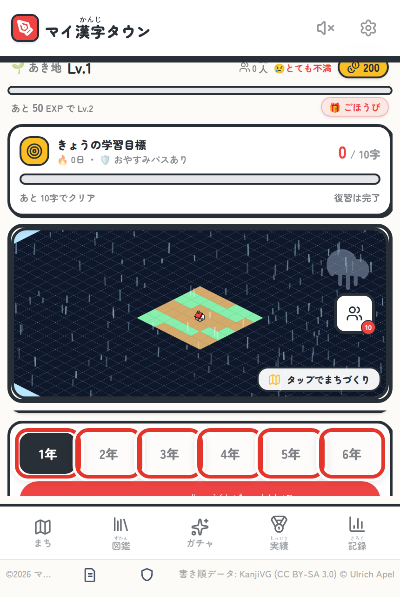

赤いわくの 6つが がくねんの ボタンです。

【！】おぼえておいて ほしいこと:

- <ruby>学年<rt>がくねん</rt></ruby>は いつでも かえられます。ホームの 同じ ボタンを おすだけです
- 上の<ruby>学年<rt>がくねん</rt></ruby>に かえても、下の<ruby>学年<rt>がくねん</rt></ruby>で おぼえた字は きえません
- ならっていない字が むずかしいと かんじたら、下の<ruby>学年<rt>がくねん</rt></ruby>に もどして ください

## ホームの 見かた ― どこに なにが あるか

ホームの<ruby>画面<rt>がめん</rt></ruby>には、上から じゅんに つぎの ものが ならんでいます。
どこに なにが あるかを、さきに 見ておくと まよいません。

上のほうには、じぶんの レベル（Lv.）、まちの 人の数、まちの きぶん、
もっている コインの数が 出ています。その下の <ruby>細<rt>ほそ</rt></ruby>いバーは、
つぎの レベルまで あと どれくらいかを あらわします。

つぎの 白いカードが「きょうの<ruby>学習目標<rt>がくしゅうもくひょう</rt></ruby>」です。
きょう なん字 やったか、なん日 つづいているか、つぎの <ruby>復習<rt>ふくしゅう</rt></ruby>が
なん字 あるかが 出ます。

まん中の 大きな 絵が、じぶんの まちです。ここを おすと まちづくりの<ruby>画面<rt>がめん</rt></ruby>に
すすみます。
その下に「<ruby>今日<rt>きょう</rt></ruby>のミッション」が あり、きょうの もくひょうと
ごほうびが 出ます。

<ruby>学年<rt>がくねん</rt></ruby>の ボタンの すぐ下に ある 赤い 大きなボタンが、
きょうの<ruby>学習<rt>がくしゅう</rt></ruby>の 入口です。
その下に「マイドリル」と「<ruby>通信<rt>つうしん</rt></ruby>でもらう」、さらに下に
とくべつトレーニングの「フラッシュ」「サバイバル」「ボスバトル」が ならびます。

<ruby>画面<rt>がめん</rt></ruby>の いちばん下には、いつも 5つの ボタンが 出ています。
「まち」「<ruby>図鑑<rt>ずかん</rt></ruby>」「ガチャ」「<ruby>実績<rt>じっせき</rt></ruby>」
「<ruby>記録<rt>きろく</rt></ruby>」です。
どの<ruby>画面<rt>がめん</rt></ruby>からでも、ここから 行けます。

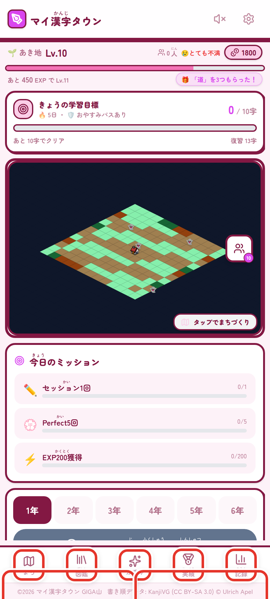

赤いわくが、よく つかう ボタンです。

## きょうの<ruby>学習<rp>（</rp><rt>がくしゅう</rt><rp>）</rp></ruby>を 4つの ステップで すすめる

まいにちの <ruby>学習<rt>がくしゅう</rt></ruby>は、赤い 大きなボタンから はじめます。
1字ごとに「<ruby>音読<rt>おんどく</rt></ruby> →
<ruby>書<rt>か</rt></ruby>き<ruby>順<rt>じゅん</rt></ruby> → なぞる → テスト」の
4つを じゅんに すすみます。

大きな ながれ:

1. 赤い 大きなボタンを おして、きょうの <ruby>学習<rt>がくしゅう</rt></ruby>を はじめる。
2. <ruby>音読<rt>おんどく</rt></ruby> ― <ruby>声<rt>こえ</rt></ruby>に出して 読む。
3. <ruby>書<rt>か</rt></ruby>き<ruby>順<rt>じゅん</rt></ruby> ― 書く じゅんばんを 見る。
4. なぞる ― うすい お手本を なぞる。
5. テスト ― なにも 見ないで 書く。
6. じぶんの できを 4つの ボタンから えらぶ。つぎの字へ すすむ。

### 大きな赤いボタンから はじめる

ボタンには、きょう 出る 字数が 書いてあります。
たとえば「きょうの10字：<ruby>復習<rt>ふくしゅう</rt></ruby>10＋<ruby>新出<rt>しんしゅつ</rt></ruby>0」なら、
きょうは <ruby>復習<rt>ふくしゅう</rt></ruby>が 10字で、はじめての字は 0字、という いみです。

字数は 日によって かわります。<ruby>復習<rt>ふくしゅう</rt></ruby>の ひつような字が
たまっていると ふえます。

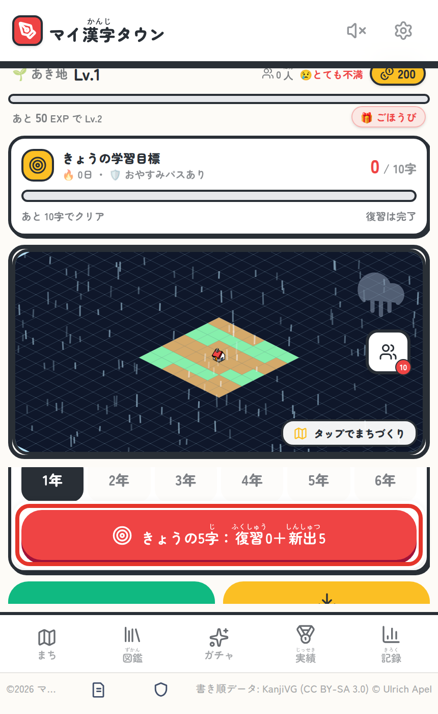

赤いわくの ボタンから はじめます。

### <ruby>音読<rp>（</rp><rt>おんどく</rt><rp>）</rp></ruby> ― <ruby>声<rp>（</rp><rt>こえ</rt><rp>）</rp></ruby>に出して <ruby>読<rp>（</rp><rt>よ</rt><rp>）</rp></ruby>む

さいしょの<ruby>画面<rt>がめん</rt></ruby>には、大きな 字と、その字を つかった 文が 出ます。
下には <ruby>音読<rt>おんよ</rt></ruby>み（オン）と <ruby>訓読<rt>くんよ</rt></ruby>み（くん）が
ならんでいます。

すすめかた:

1. 出ている 字と 文を、<ruby>声<rt>こえ</rt></ruby>に出して 読みます。
2. 文が いくつか あるときは、右の <ruby>丸<rt>まる</rt></ruby>い やじるしで つぎの文に かわります。
3. 読めたら、下の「<ruby>書<rt>か</rt></ruby>き<ruby>順<rt>じゅん</rt></ruby>をみる」を おします。

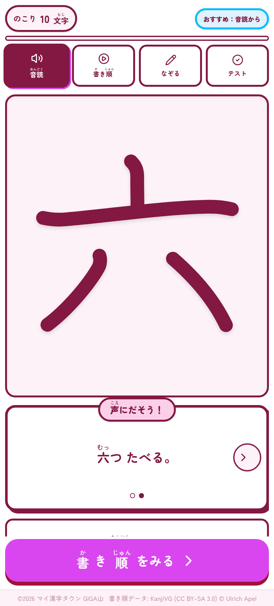

下の 赤い ボタンで つぎへ すすみます。

はじめて この<ruby>画面<rt>がめん</rt></ruby>に 来たときだけ、上に 水色の ふきだしが 出ます。
マイクを つかう「<ruby>音読<rt>おんどく</rt></ruby>チャレンジ」の あんないです。
「×」で とじられます。とじても、あとで もう一度 出ることは ありません。

<ruby>音読<rt>おんどく</rt></ruby>チャレンジは やらなくても かまいません。
できると ボーナスの EXP（けいけんち）が もらえますが、
やらなくても つぎの ステップに すすめます。<ruby>声<rt>こえ</rt></ruby>は ろくおんされません。

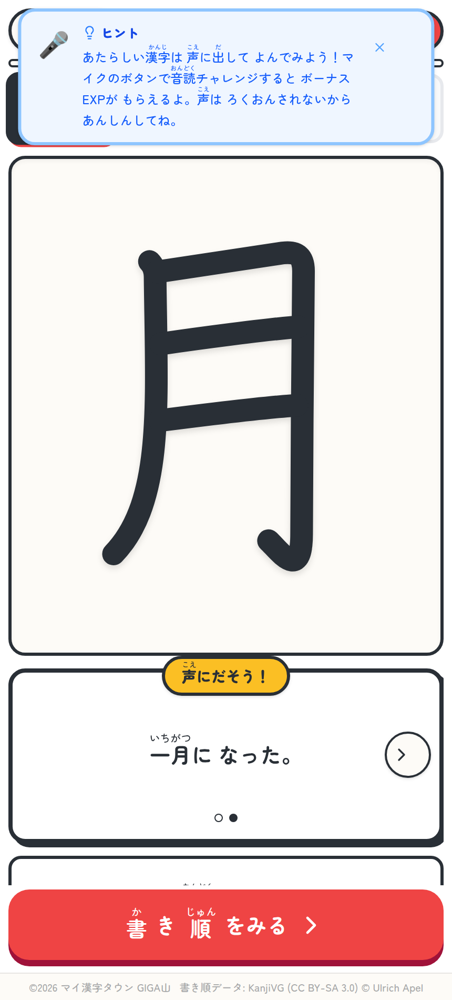

マイクの ボタンは この ふきだしの 下に あります。

### <ruby>書<rp>（</rp><rt>か</rt><rp>）</rp></ruby>き<ruby>順<rp>（</rp><rt>じゅん</rt><rp>）</rp></ruby> ― <ruby>書<rp>（</rp><rt>か</rt><rp>）</rp></ruby>く じゅんばんを 見る

うすい お手本の上を、<ruby>線<rt>せん</rt></ruby>が 1<ruby>画<rt>かく</rt></ruby>ずつ うごきます。
どの じゅんばんで 書くのかを、ここで 見ます。

- もう一度 見たいときは「もう一度みる」を おします。
- 見おわったら「なぞり<ruby>書<rt>が</rt></ruby>きへ」を おします。

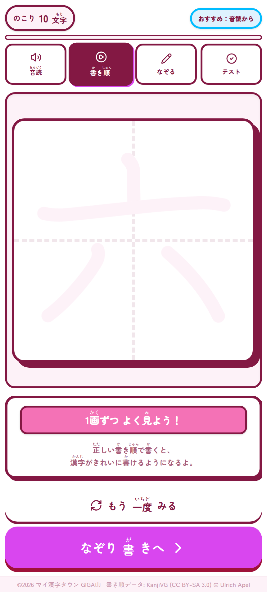

1 2 3 4 の 数字が かくの じゅんばんです。

### なぞる ― うすい お手本を なぞる

うすく 出ている お手本の上を、ゆびか ペンで なぞります。
1<ruby>画<rt>かく</rt></ruby>ずつ 見ていて、書きはじめの ばしょが ちがうと
「かきはじめが ちがうよ」と 出ます。

なぞりかた:

1. 「１かくめ をかこう！」と 出たら、1<ruby>画<rt>かく</rt></ruby>めを なぞります。
2. なぞれたら、つぎの<ruby>画<rt>かく</rt></ruby>へ すすみます。
3. まちがえたときは「1<ruby>画<rt>かく</rt></ruby>もどす」で 1つ もどせます。
4. さいしょから やりなおすときは「ぜんぶけす」を おします。

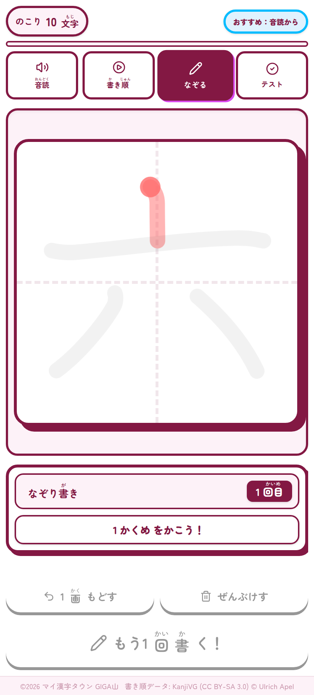

下に 3つの ボタンが あります。

なぞりは 3回 くりかえします。1回ごとに お手本が うすく なっていき、
3回目には ほとんど 見えなく なります。少しずつ じぶんの力で 書けるように なります。

同じ字を もう一度 なぞりたいときは「もう1回書く！」を おします。
つぎへ すすむときは、上の「テスト」の タブを おします。

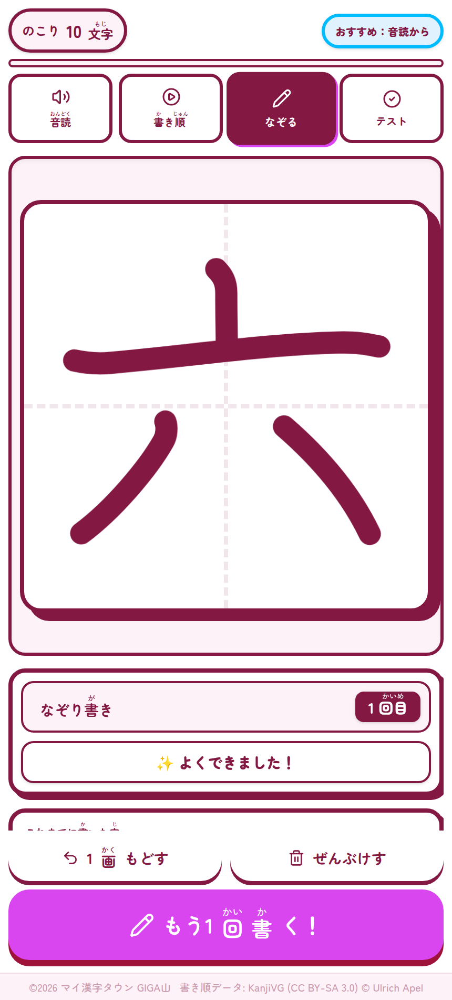

なぞった せんが こく のこります。

### テスト ― なにも 見ないで <ruby>書<rp>（</rp><rt>か</rt><rp>）</rp></ruby>く

さいごは、お手本を 見ないで 書きます。
上に 読みかたが 出るので、その字を まっ白な ますに 書いてください。

かきかた:

1. ますの 中に、ゆびか ペンで 書きます。
2. 1<ruby>画<rt>かく</rt></ruby> まちがえたときは「1<ruby>画<rt>かく</rt></ruby>もどす」を おします。
3. ぜんぶ 書きなおすときは「書きなおす」を おします。
4. 書けたら「こたえあわせ」を おします。

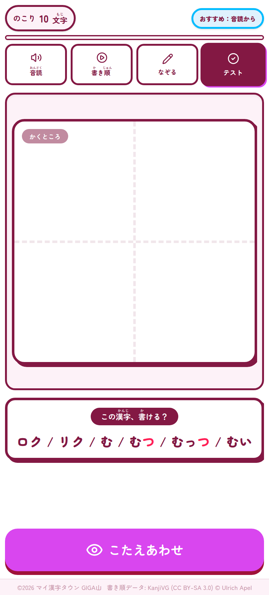

なにも 見ないで、ここに 書きます。

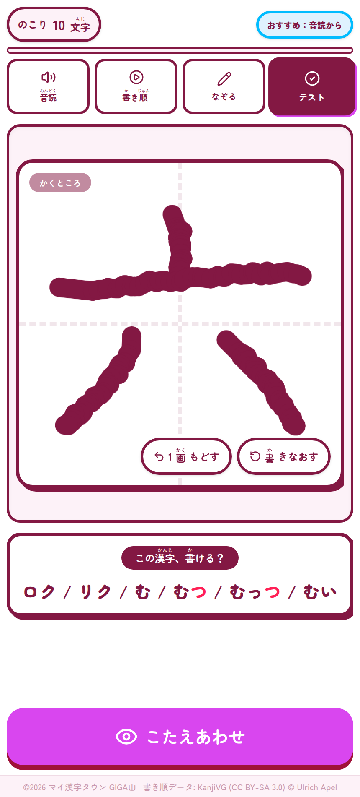

書きおわると「こたえあわせ」が おせます。

【！】おぼえておいて ほしいこと:

- とちゅうで タブが とじても、つぎに ひらいたとき つづきから はじまります
- 上の 4つの タブ（<ruby>音読<rt>おんどく</rt></ruby>・<ruby>書<rt>か</rt></ruby>き<ruby>順<rt>じゅん</rt></ruby>・なぞる・テスト）は、いつでも 行き来できます
- すでに <ruby>練習<rt>れんしゅう</rt></ruby>した字は、4つ ぜんぶを 通らずに、にがてな ところから はじまります

## <ruby>書<rp>（</rp><rt>か</rt><rp>）</rp></ruby>いた字の <ruby>点数<rp>（</rp><rt>てんすう</rt><rp>）</rp></ruby>の 見かた

書いた字は、100<ruby>点<rt>てん</rt></ruby>まんてんで <ruby>点数<rt>てんすう</rt></ruby>が つきます。
どこが ちがったのかも 出るので、つぎに 気をつける ところが わかります。

### こたえあわせで どこが ちがったかを 見る

<ruby>画面<rt>がめん</rt></ruby>には 2つの ますが ならびます。
左の「かくところ」が じぶんの 書いた字、右の「こたえ」が お手本です。

その下の <ruby>帯<rt>おび</rt></ruby>に、ひとことで けっかが 出ます。
「よく書けているよ！」なら <ruby>合格<rt>ごうかく</rt></ruby>です。
「かくすうが ちがうよ」のように 出たときは、どこが ちがったかを おしえています。

<ruby>点数<rt>てんすう</rt></ruby>は、字の かたち・<ruby>書<rt>か</rt></ruby>き<ruby>順<rt>じゅん</rt></ruby>・
とめはね・<ruby>線<rt>せん</rt></ruby>の まじわり・書きはじめ・書きおわりの
6つを 見て つけます。<ruby>書<rt>か</rt></ruby>き<ruby>順<rt>じゅん</rt></ruby>を まちがえると、
見た目が よくても 高い<ruby>点<rt>てん</rt></ruby>には なりません。

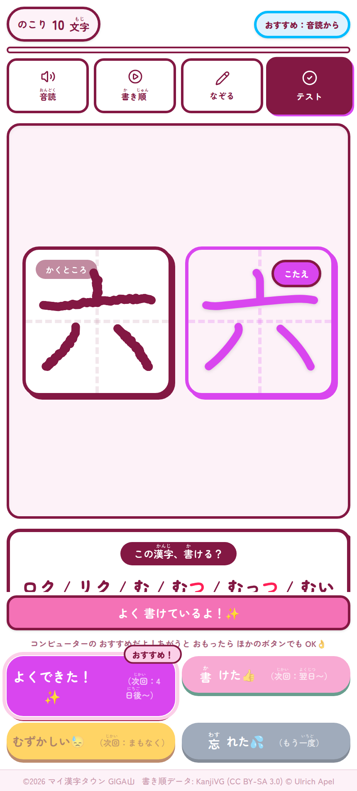

左が じぶんの字、右が お手本です。

### 4つの ボタンで じぶんの できを つたえる

下に 4つの ボタンが あります。じぶんの かんじかたに 近いものを おします。

- 「よくできた！」つぎに 出るのは 4日<ruby>後<rt>ご</rt></ruby>くらいです
- 「書けた」つぎに 出るのは あしたです
- 「むずかしい」まもなく また 出ます
- 「忘れた」もう一度、さいしょから 出ます

「おすすめ！」の しるしが ついた ボタンは、アプリが すすめている ものです。
ちがうと おもったら、ほかの ボタンを おしても かまいません。

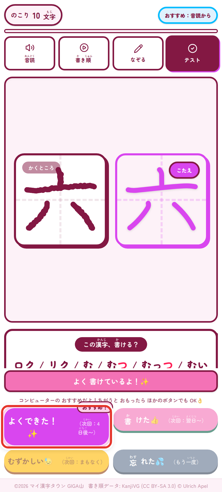

赤いわくが おすすめの ボタンです。

### さいごに もらえる ごほうびを たしかめる

その日の 字を ぜんぶ おえると、まとめの<ruby>画面<rt>がめん</rt></ruby>に なります。
もらった EXP と、まちで つかえる ざいりょうが 出ます。

ここから「まちにもどる」で ホームへ、「まちをつくる」で まちづくりへ すすめます。
コインが たまっていれば、そのまま ガチャを ひくことも できます。

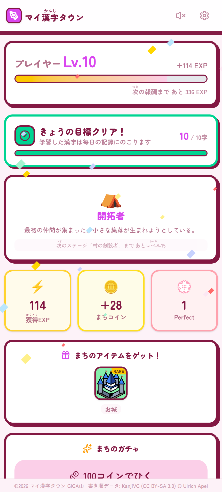

もらった EXP が 上に 出ます。

## とくべつトレーニングで まとめて <ruby>復習<rp>（</rp><rt>ふくしゅう</rt><rp>）</rp></ruby>する

1字でも おぼえると、ホームの 下のほうに 3つの ボタンが 出ます。
おぼえた字を まとめて 見なおしたいときに つかいます。

まだ 1字も おぼえていないと、3つは 白い カバーが かかっていて おせません。
「まずは漢字を覚えよう！」と 出ているときは、さきに きょうの<ruby>学習<rt>がくしゅう</rt></ruby>を
してください。

### フラッシュ ― <ruby>読<rp>（</rp><rt>よ</rt><rp>）</rp></ruby>みだけを 早く 見なおす

おぼえた字から 10字が ランダムに 出ます。カードを タップすると 読みが 出ます。
「読めた」か「読めなかった」を えらんで、つぎへ すすみます。

書く ひつようは ありません。読みだけを 早く たしかめたいときに つかいます。

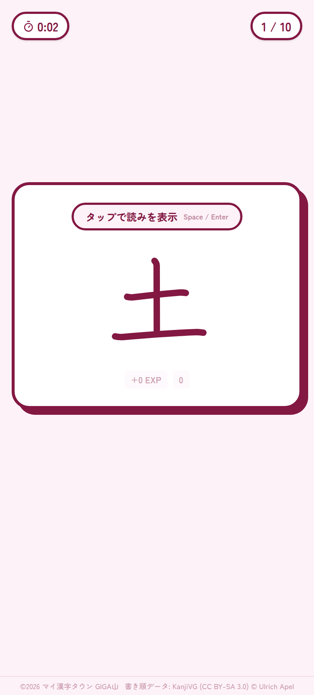

カードを タップすると 読みが 出ます。

### サバイバル ― <ruby>時間<rp>（</rp><rt>じかん</rt><rp>）</rp></ruby>の中で <ruby>書<rp>（</rp><rt>か</rt><rp>）</rp></ruby>きつづける

<ruby>時間<rt>じかん</rt></ruby>が ある かぎり、おぼえた字を 書きつづけます。
「この「◯」は<ruby>何<rt>なん</rt></ruby>の<ruby>漢字<rt>かんじ</rt></ruby>？」と 文が 出るので、
◯に 入る字を 書きます。

- 書けたら「GO!」を おします。書きなおすときは「消す」です
- <ruby>正解<rt>せいかい</rt></ruby>が つづくと コンボが たまり、<ruby>点<rt>てん</rt></ruby>が 高く なります
- 10<ruby>問<rt>もん</rt></ruby>ごとに ウェーブが 上がります

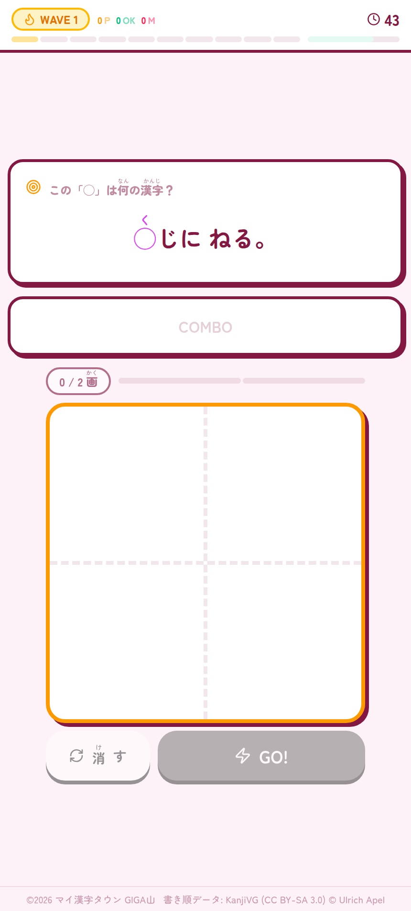

上に のこりじかんと てんすうが 出ます。

### ボスバトル ― にがてな字だけで たたかう

まちがえることの 多い字 10字が 出ます。書くと ボスに ダメージを あたえられます。
書いたら「攻撃する！」を、書きなおすときは「書き直す」を おします。

まけても だいじょうぶです。ごほうびは <ruby>半分<rt>はんぶん</rt></ruby>に なりますが もらえます。
まちがえた字は、そのあと すぐ <ruby>復習<rt>ふくしゅう</rt></ruby>に 出るように なります。

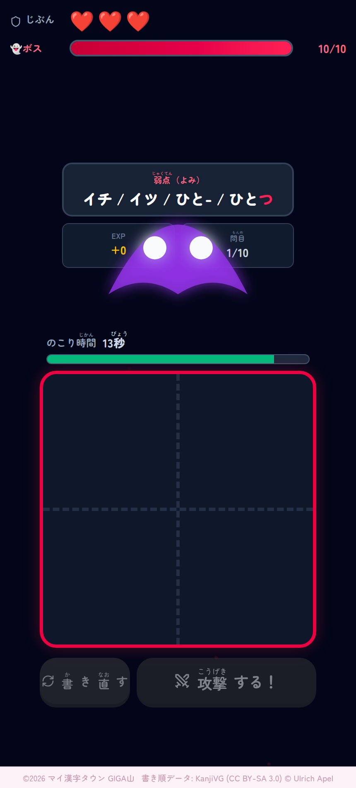

じぶんの ハートと ボスの たいりょくが 上に 出ます。

## <ruby>学習<rp>（</rp><rt>がくしゅう</rt><rp>）</rp></ruby>きろくで <ruby>自分<rp>（</rp><rt>じぶん</rt><rp>）</rp></ruby>の のびを 見る

<ruby>画面<rt>がめん</rt></ruby>の いちばん下の「<ruby>記録<rt>きろく</rt></ruby>」から ひらきます。
どれだけ おぼえたか、どの力が よわいかが わかります。

### おぼえた字の <ruby>数<rp>（</rp><rt>かず</rt><rp>）</rp></ruby>と 4つの力を たしかめる

いちばん上に「<ruby>漢字<rt>かんじ</rt></ruby>の<ruby>習得状況<rt>しゅうとくじょうきょう</rt></ruby>（全1026文字）」が 出ます。
「<ruby>習得<rt>しゅうとく</rt></ruby>」「<ruby>学習中<rt>がくしゅうちゅう</rt></ruby>」
「<ruby>未学習<rt>みがくしゅう</rt></ruby>」の 3つの数に わかれています。

その下が「<ruby>漢字<rt>かんじ</rt></ruby>を<ruby>身<rt>み</rt></ruby>につける「4つの力」」です。
「<ruby>読<rt>よ</rt></ruby>み」「<ruby>意味<rt>いみ</rt></ruby>」「<ruby>書字<rt>しょじ</rt></ruby>」
「<ruby>筆順<rt>ひつじゅん</rt></ruby>」を それぞれ 100<ruby>点<rt>てん</rt></ruby>まんてんで 出します。

4つを 分けて 出すのは、「読めるけれど 書けない」のような ことを 見わけるためです。
<ruby>点<rt>てん</rt></ruby>の ひくい ところが、いま <ruby>練習<rt>れんしゅう</rt></ruby>すると
いちばん のびる ところです。

さらに 下には、つづけた 日数、これまでの EXP、<ruby>今週<rt>こんしゅう</rt></ruby>の もくひょう、
7日間の <ruby>正解率<rt>せいかいりつ</rt></ruby>が ならびます。

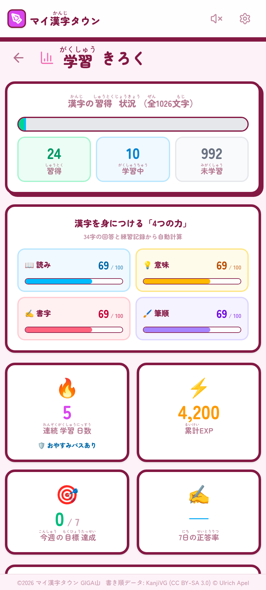

3つの 数と 4つの力が わかります。

### これから 出る字と にがてな字を 見る

下へ すすむと、7日間の <ruby>学習<rt>がくしゅう</rt></ruby>の ぼうグラフ、さいきん やったこと、
これから 7日間に 出る <ruby>復習<rt>ふくしゅう</rt></ruby>の 数、にがてな字が ならびます。

にがてな字の ところに「にがて<ruby>特訓<rt>とっくん</rt></ruby>」の ボタンが あります。
おすと、その字だけを あつめた <ruby>練習<rt>れんしゅう</rt></ruby>が すぐ はじまります。

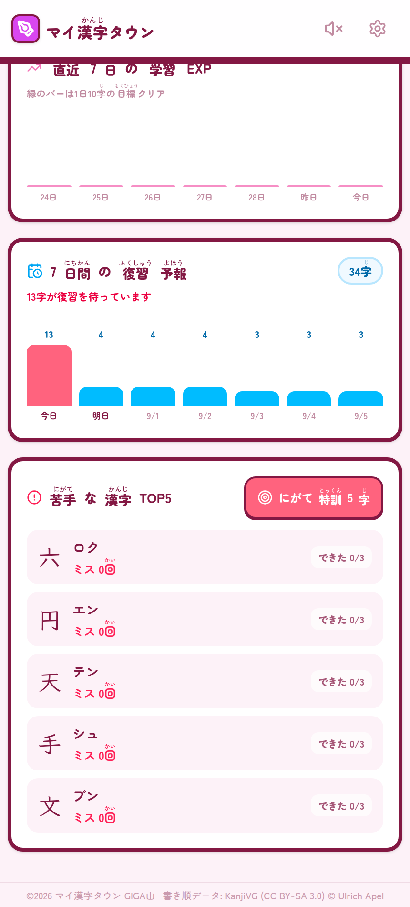

「にがて特訓」から すぐ 練習できます。

### <ruby>学習<rp>（</rp><rt>がくしゅう</rt><rp>）</rp></ruby>きろくを A4 で <ruby>印刷<rp>（</rp><rt>いんさつ</rt><rp>）</rp></ruby>する

この<ruby>画面<rt>がめん</rt></ruby>は、そのまま <ruby>紙<rt>かみ</rt></ruby>に
<ruby>印刷<rt>いんさつ</rt></ruby>できます。
<ruby>面談<rt>めんだん</rt></ruby>や おたよりに つかうときは、つぎのように してください。

<ruby>印刷<rt>いんさつ</rt></ruby>の手順:

1. キーボードの Ctrl と P を いっしょに おします（Mac は コマンドと P です）。
2. <ruby>用紙<rt>ようし</rt></ruby>が A4、むきが たて に なっているかを たしかめます。
3. 「背景のグラフィック」を オンに します。オフのままだと、<ruby>正解<rt>せいかい</rt></ruby>・まちがいの <ruby>色分<rt>いろわ</rt></ruby>けが 消えます。
4. 「<ruby>印刷<rt>いんさつ</rt></ruby>」を おします。

【！】おぼえておいて ほしいこと:

- <ruby>画面<rt>がめん</rt></ruby>の 上の ナビゲーションと 下の フッターは、<ruby>印刷<rt>いんさつ</rt></ruby>には 出ません
- <ruby>印刷<rt>いんさつ</rt></ruby>した<ruby>紙<rt>かみ</rt></ruby>には <ruby>名前<rt>なまえ</rt></ruby>が 入りません。だれの <ruby>記録<rt>きろく</rt></ruby>かを 手で 書きくわえてください

## <ruby>漢字<rp>（</rp><rt>かんじ</rt><rp>）</rp></ruby>ずかんで さがして 1字だけ <ruby>練習<rp>（</rp><rt>れんしゅう</rt><rp>）</rp></ruby>する

<ruby>画面<rt>がめん</rt></ruby>の いちばん下の「<ruby>図鑑<rt>ずかん</rt></ruby>」から ひらきます。
1026字ぜんぶを 見られて、気になる 1字だけを <ruby>練習<rt>れんしゅう</rt></ruby>できます。

### 学年や <ruby>読<rp>（</rp><rt>よ</rt><rp>）</rp></ruby>みで 字を さがす

上の タブで <ruby>学年<rt>がくねん</rt></ruby>を えらべます。「すべて」と「1年」から「6年」が あります。
タブには、その<ruby>学年<rt>がくねん</rt></ruby>で いくつ おぼえたかが 出ます
（たとえば「1年 34/80」）。

字は 4つの いろで 分かれています。
「<ruby>習得<rt>しゅうとく</rt></ruby>」「<ruby>学習中<rt>がくしゅうちゅう</rt></ruby>」
「<ruby>復習中<rt>ふくしゅうちゅう</rt></ruby>」「<ruby>未学習<rt>みがくしゅう</rt></ruby>」です。
いまの じぶんの ようすが 一目で わかります。

上の さがす らんに <ruby>漢字<rt>かんじ</rt></ruby>や 読みを 入れると、その字だけが のこります。
見つからないときは「見つかりませんでした」と 出ます。

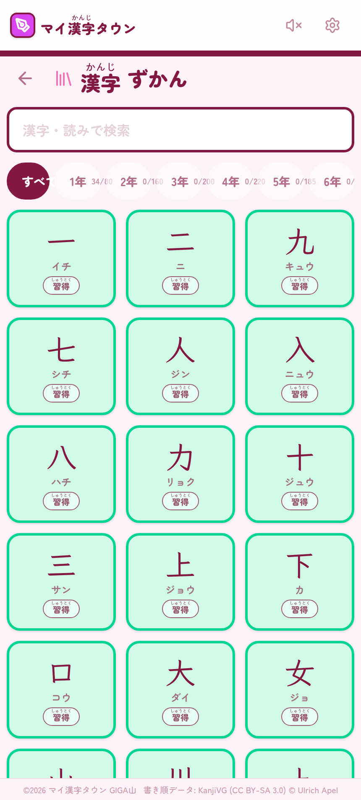

がくねんの タブと 字の 一らんです。

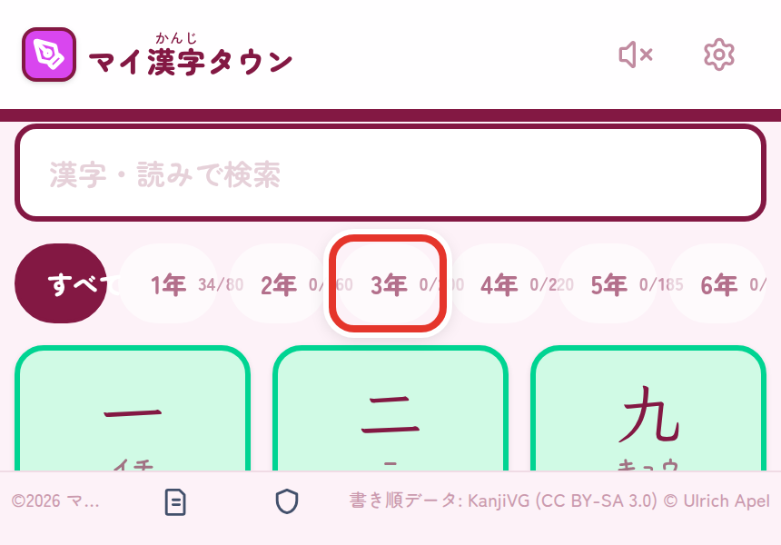

赤いわくの タブで がくねんを かえます。

### 字を えらんで その字だけ <ruby>練習<rp>（</rp><rt>れんしゅう</rt><rp>）</rp></ruby>する

<ruby>一覧<rt>いちらん</rt></ruby>の 中の 字を おすと、その 1字だけの
<ruby>練習<rt>れんしゅう</rt></ruby>が はじまります。
きょうの<ruby>学習<rt>がくしゅう</rt></ruby>と 同じ 4つの ステップを 通ります。

<ruby>漢字<rt>かんじ</rt></ruby>テストの 前の日など、「この字だけ もう一度 やりたい」ときに
つかってください。

## <ruby>実績<rp>（</rp><rt>じっせき</rt><rp>）</rp></ruby>を あつめて ごほうびを もらう

<ruby>画面<rt>がめん</rt></ruby>の いちばん下の「<ruby>実績<rt>じっせき</rt></ruby>」から ひらきます。
がんばりに あわせて、コインや <ruby>建物<rt>たてもの</rt></ruby>が もらえます。

### 92この <ruby>実績<rp>（</rp><rt>じっせき</rt><rp>）</rp></ruby>を 見る

<ruby>実績<rt>じっせき</rt></ruby>は ぜんぶで 92こ あります。
上の タブで 5つの なかまに 分かれています。
「<ruby>学習<rt>がくしゅう</rt></ruby>」「<ruby>学年制覇<rt>がくねんせいは</rt></ruby>」
「まちづくり」「<ruby>毎日<rt>まいにち</rt></ruby>のがんばり」
「<ruby>成長<rt>せいちょう</rt></ruby>の<ruby>記録<rt>きろく</rt></ruby>」です。

それぞれの カードに、いまの 数と めざす 数、もらえる ごほうびが 出ます。
とどいた ものには「受けとる！」の ボタンが 出るので、おして うけとってください。

うけとらないと、ごほうびは もらえません。ときどき 見にきてください。

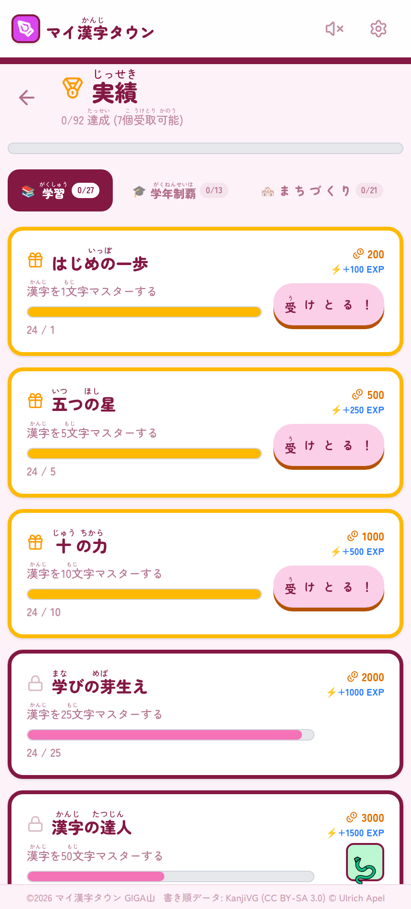

「受けとる！」を おすと もらえます。

### まいにち ひらいて ログインボーナスを もらう

2日目からは、ひらいた ときに ログインボーナスが 出ることが あります。
7日分の ごほうびが ならび、つづけた 日数の ところが もらえます。

「うけとる！」を おすと とじます。おすまで、ほかの ボタンは おせません。

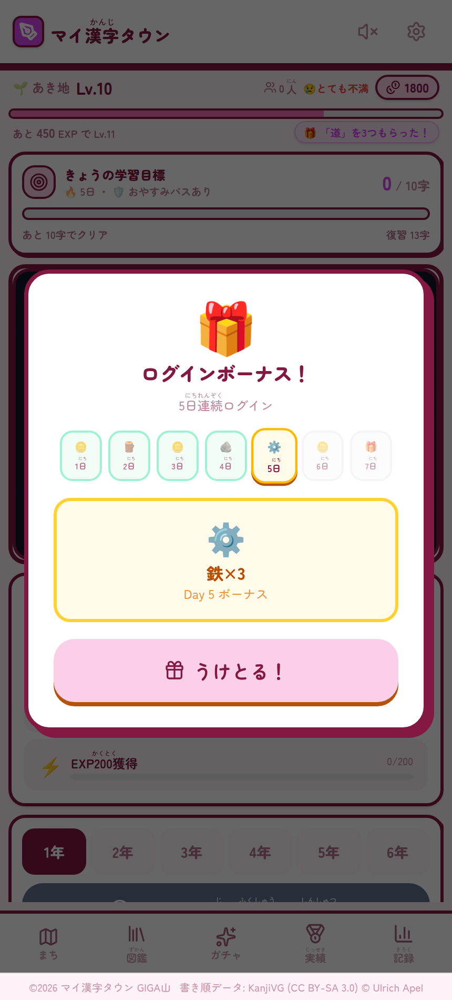

「うけとる！」で とじます。

## まちを そだてる ― <ruby>建物<rp>（</rp><rt>たてもの</rt><rp>）</rp></ruby>を <ruby>作<rp>（</rp><rt>つく</rt><rp>）</rp></ruby>って ならべる

ホームの まん中の 絵を おすか、いちばん下の「まち」から ひらきます。
<ruby>学習<rt>がくしゅう</rt></ruby>を すすめると、ここに おける ものが ふえていきます。

### <ruby>地面<rp>（</rp><rt>じめん</rt><rp>）</rp></ruby>を ひらいて <ruby>建物<rp>（</rp><rt>たてもの</rt><rp>）</rp></ruby>を おく

まちは 50×50 の ますで できています。
はじめは まん中の 少しだけが ひらけていて、まわりは くらいままです。

- くらい ところを おすと、コインを つかって ひらけます
- おいた ものを おすと、うごかしたり おきなおしたり できます
- 右の <ruby>虫<rt>むし</rt></ruby>めがねの ボタンで、大きく したり 小さく したり できます
- 左上の やじるしで、ひとつ前に もどせます
- かえたら、右上の「<ruby>保存<rt>ほぞん</rt></ruby>」を おします

下に 3つの ボタンが あります。「もちもの」「つくる」「<ruby>住民<rt>じゅうみん</rt></ruby>」です。

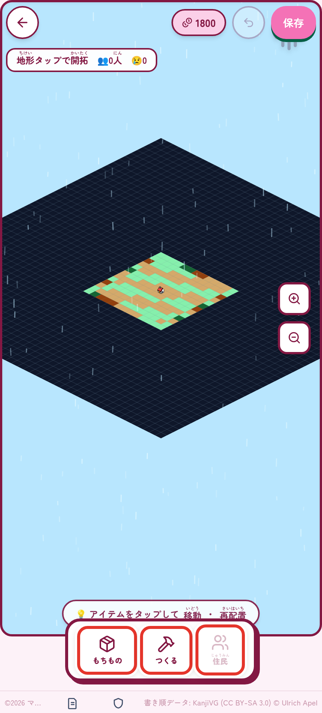

赤いわくの 3つが 下の ボタンです。

### クラフトで <ruby>建物<rp>（</rp><rt>たてもの</rt><rp>）</rp></ruby>を <ruby>作<rp>（</rp><rt>つく</rt><rp>）</rp></ruby>る

下の「つくる」から ひらきます。<ruby>学習<rt>がくしゅう</rt></ruby>で あつまった
ざいりょうで、<ruby>建物<rt>たてもの</rt></ruby>や 新しい ざいりょうを 作れます。
ぜんぶで 121<ruby>種類<rt>しゅるい</rt></ruby> あります。

上に いま もっている ざいりょうが 出ます。
その下の タブで「<ruby>加工素材<rt>かこうそざい</rt></ruby>」「<ruby>建物<rt>たてもの</rt></ruby>」
「<ruby>強化<rt>きょうか</rt></ruby>」「<ruby>大型<rt>おおがた</rt></ruby>」「レア」に 分かれています。

作りかた:

1. 作りたい ものの カードを さがします。
2. 「-」と「+」で 数を きめます。ぜんぶ 作るときは「MAX」を おします。
3. 「クラフトする」を おします。

ざいりょうが たりないときは「<ruby>素材不足<rt>そざいぶそく</rt></ruby>」と 出て、おせません。
<ruby>学習<rt>がくしゅう</rt></ruby>を すすめると ざいりょうが たまります。

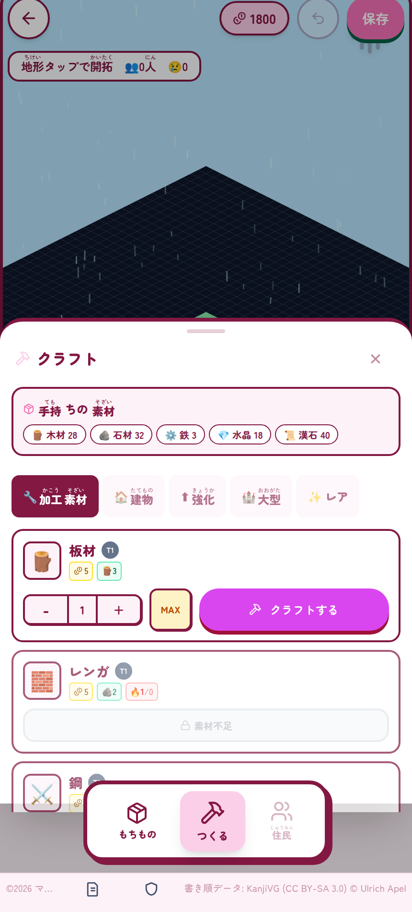

上に もっている ざいりょうが 出ます。

### ガチャで めずらしい <ruby>建物<rp>（</rp><rt>たてもの</rt><rp>）</rp></ruby>を ひく

いちばん下の「ガチャ」から ひらきます。コインを つかって
<ruby>建物<rt>たてもの</rt></ruby>を ひきます。

- 「1回」は 100コインです
- 「10<ruby>連<rt>れん</rt></ruby>」は 1000コインです
- ながい えんしゅつは「演出をスキップする」で とばせます

コインは <ruby>学習<rt>がくしゅう</rt></ruby>と <ruby>実績<rt>じっせき</rt></ruby>で たまります。
ひかなくても まちは そだちます。

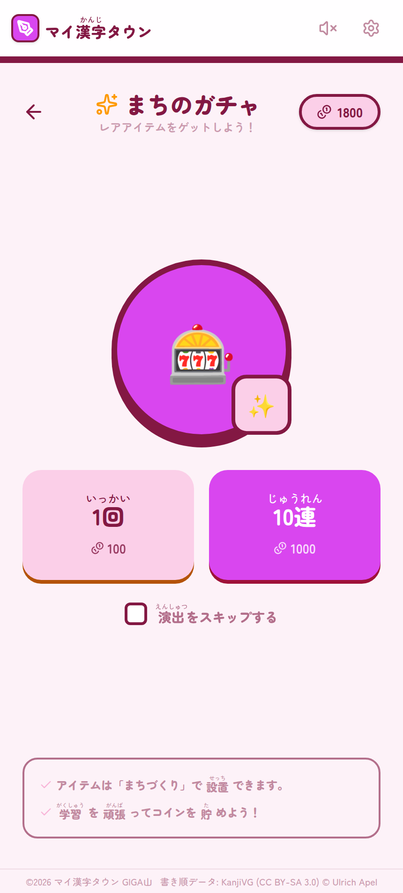

いま もっている コインが 上に 出ます。

### しばらく ひらかないと まちが あれる

ながく ひらかないと、まちは だんだん あれていきます。
1日で くさが はえ、3日で 人が 少し へり、7日で <ruby>建物<rt>たてもの</rt></ruby>が
<ruby>元<rt>もと</rt></ruby>の 土地に もどります。

<ruby>学習<rt>がくしゅう</rt></ruby>を すると、その場で くさは とれます。
1日 やすんでも つづけた 日数を まもる「おやすみパス」も あります。
つかったあとは、5日 <ruby>学習<rt>がくしゅう</rt></ruby>すると また たまります。

## せっていで 音・文字・<ruby>学習<rp>（</rp><rt>がくしゅう</rt><rp>）</rp></ruby>の <ruby>量<rp>（</rp><rt>りょう</rt><rp>）</rp></ruby>を かえる

<ruby>画面<rt>がめん</rt></ruby>の 右上の はぐるまの ボタンから ひらきます。
見た目・音・<ruby>学習<rt>がくしゅう</rt></ruby>の 量を かえられます。

### 見た目と 音を かえる

いちばん上が「テーマ」です。7つから えらべます。
「じどう」「ベーシック」「さくら」「うみ」「ゆうやけ」「おうごん」「ダーク」です。
「じどう」は レベルに あわせて 色が かわります。

つぎが「<ruby>画面<rt>がめん</rt></ruby>のうごき」です。「じどう」「<ruby>標準<rt>ひょうじゅん</rt></ruby>」
「少なめ」の 3つです。
「少なめ」に すると、うごきや <ruby>天気<rt>てんき</rt></ruby>や
<ruby>紙<rt>かみ</rt></ruby>ふぶきを おさえます。
うごきが おそい <ruby>端末<rt>たんまつ</rt></ruby>や、<ruby>電池<rt>でんち</rt></ruby>を
もたせたい ときに つかってください。

その下が「音の<ruby>設定<rt>せってい</rt></ruby>」です。「オフ」「小」「中」「大」の 4つから えらびます。
<ruby>画面<rt>がめん</rt></ruby>の 右上の スピーカーの ボタンでも、音を すぐ けせます。

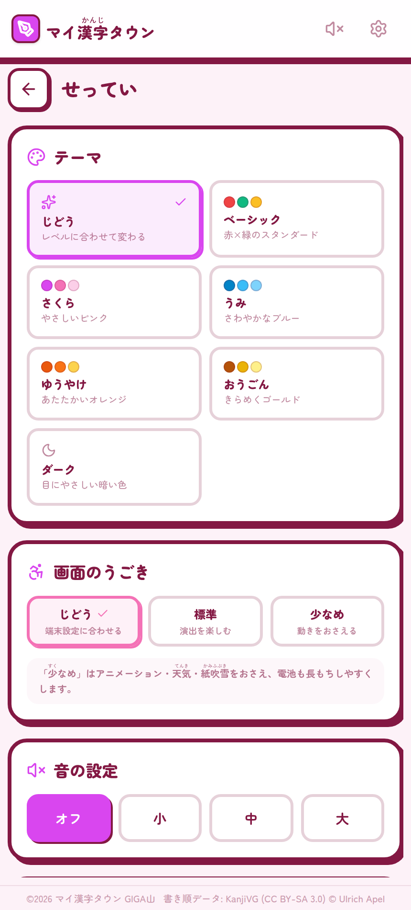

テーマと うごきと 音を えらびます。

### ふりがな・<ruby>音読<rp>（</rp><rt>おんどく</rt><rp>）</rp></ruby>チャレンジ・1日の<ruby>量<rp>（</rp><rt>りょう</rt><rp>）</rp></ruby>を かえる

「<ruby>学習<rt>がくしゅう</rt></ruby>せってい」には、5つの こうもくが あります。

- 「ふりがなを<ruby>表示<rt>ひょうじ</rt></ruby>」<ruby>漢字<rt>かんじ</rt></ruby>の上に ひらがなを 出すか どうか
- 「<ruby>自動再生<rt>じどうさいせい</rt></ruby>」<ruby>音読<rt>おんどく</rt></ruby>の とき、お手本の <ruby>声<rt>こえ</rt></ruby>を じどうで ながすか どうか
- 「<ruby>音読<rt>おんどく</rt></ruby>チャレンジ」マイクを つかう チャレンジを 出すか どうか
- 「1回のセッションの量」少なめ・ふつう・多め の 3つから えらびます
- 「1日の<ruby>学習目標<rt>がくしゅうもくひょう</rt></ruby>」5字・10字・20字。はじめは 10字です

はじめての ころは「少なめ」と「5字」から はじめると つづけやすいです。
なれてきたら ふやしてください。

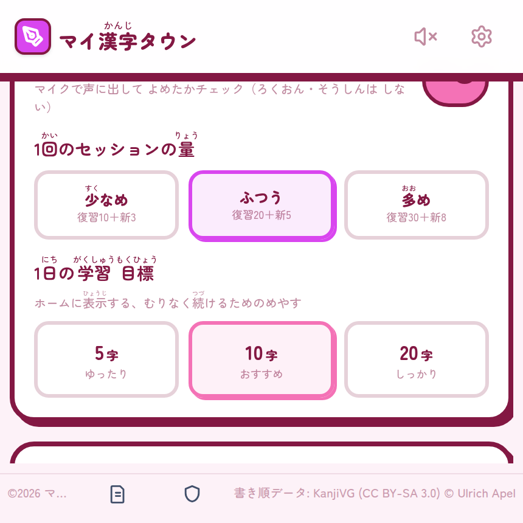

1日の もくひょうは ここで かえます。

## 【重要】ホーム<ruby>画面<rp>（</rp><rt>がめん</rt><rp>）</rp></ruby>に 入れて、<ruby>記録<rp>（</rp><rt>きろく</rt><rp>）</rp></ruby>を まもる

アプリのように 1回 おすだけで ひらけるように なり、
インターネットが 切れていても つかえるように なります。

それだけでは ありません。ホーム<ruby>画面<rt>がめん</rt></ruby>に 入れておくと、
<ruby>学習<rt>がくしゅう</rt></ruby>の <ruby>記録<rt>きろく</rt></ruby>が 消えにくく なります。
つづけて つかうなら、はじめの日に かならず やっておいてください。

せっていの 下のほうに「ホーム<ruby>画面<rt>がめん</rt></ruby>に入れる」という ところが あります。
やりかたは <ruby>端末<rt>たんまつ</rt></ruby>に よって ちがいます。

### Chromebook や Windows で 入れる

Chrome の ときは、アプリの中の ボタンから 入れられます。

入れかた:

1. 右上の はぐるまから せっていを ひらきます。
2. 下へ さげて「ホーム<ruby>画面<rt>がめん</rt></ruby>に入れる」を さがします。
3. 「ホームに入れる」を おします。
4. たしかめの まどが 出たら、そのまま すすめてください。

アドレスの らんの 右はしに 出る インストールの しるしからでも 入れられます。

### iPad や iPhone で 入れる

Safari には アプリの中の ボタンが ありません。手で ついかします。

入れかた:

1. <ruby>画面<rt>がめん</rt></ruby>の 下（iPad は 右上）の <ruby>共有<rt>きょうゆう</rt></ruby>ボタン（四角に 上むきの やじるし）を おします。
2. メニューを 下へ さげます。
3. 「ホーム画面に追加」を おします。
4. 右上の「追加」を おします。

【！！】iPad と iPhone で 気をつけること:

- iPad と iPhone は、7日間 まったく ひらかないと、<ruby>記録<rt>きろく</rt></ruby>が じどうで 消えることが あります。これは Safari の しくみで、アプリでは とめられません
- ホーム<ruby>画面<rt>がめん</rt></ruby>に 入れておくと、これが 起きにくく なります
- 長い おやすみを はさむ 前には、下の「学習の記録を ほかの端末へ移す」の やりかたで、ひかえを とっておいてください

## マイドリルを 作って くばる（先生向け）

ここからは 先生が つかう ところです。児童だけで つかうときは 読まなくてかまいません。
漢字を えらんで オリジナルのドリルを 作り、学級へ くばることができます。

### ドリルを作って保存する

ホームの「マイドリル」から開きます。まだ 1つも作っていないときは
「ドリルがまだありません」と表示されます。

作成の手順:

1. 右上の「作る」を押してください。
2. いちばん上の欄にドリルの名前を入力してください（例:「1年のふくしゅう」）。
3. 学年のタブでしぼりこみ、入れたい漢字をタップしてください。選んだ字は色が変わります。
4. 画面の下に「◯文字 選択中」と選んだ字が表示されます。数をここで確認してください。
5. 「保存する」を押してください。

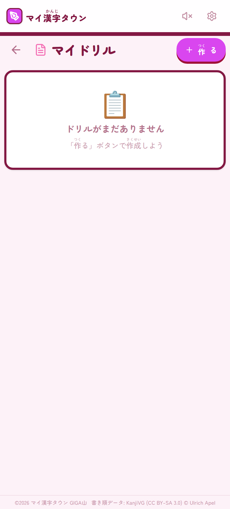

「作る」から始めます。

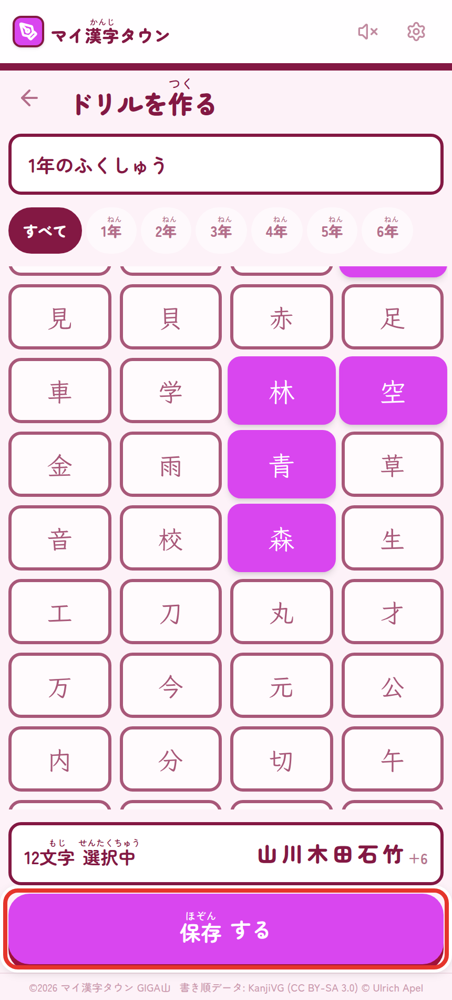

赤い枠の「保存する」で確定します。

【！】覚えておいていただきたいこと:

- 名前を空のままにすると保存できません。かならず入力してください
- 学年をまたいで選べます。「すべて」のタブから1026字すべてを選べます
- 児童の氏名や学級名を、ドリルの名前に入れないでください。リンクで配ると、その名前も一緒に相手へ渡ります

### ドリルでテストをして結果を見る

保存すると一覧にドリルが並び、5つのボタンが表示されます。
「練習」「テスト」「リンク」「送る」「削除」です。

「練習」はお手本を見ながら書く練習、「テスト」は点数のつく本番です。

テストの手順:

1. 「テスト」を押してください。
2. 問題数を選びます。10・20・50・100問のうち、ドリルの字数以下のものと「ぜんぶ（◯問）」が表示されます。
3. 「この「◯」は何の漢字？」と例文が出るので、マスに書いてください。
4. 「答える」を押すと次の問題に進みます。書き直すときは「消す」です。
5. 最後に結果の画面が出ます。

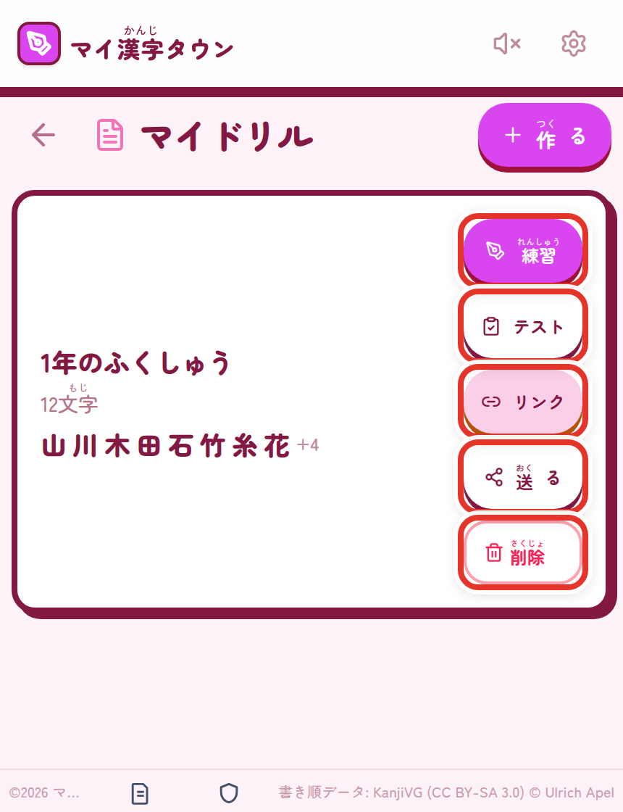

赤い枠の5つが、ドリルごとのボタンです。

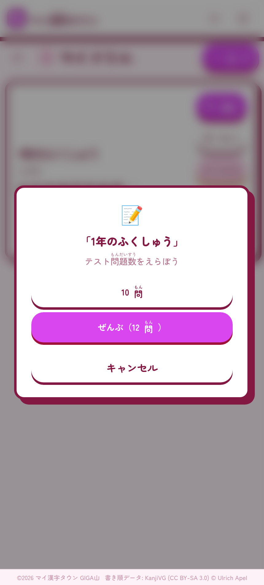

ドリルの字数に合わせて候補が変わります。

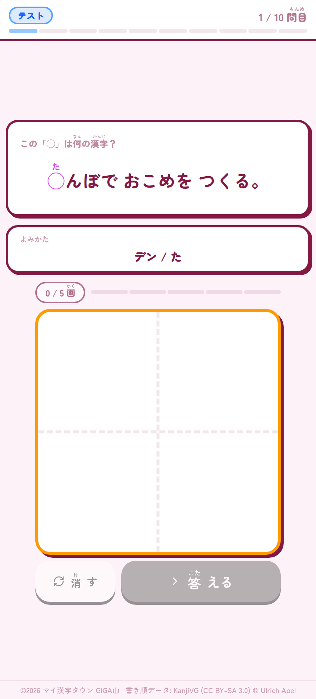

例文の◯に入る字を書きます。

結果の画面には正答率と、1問ごとのカードが並びます。
カードを押すと「なぜその点数か」が開き、書き順・字形・とめはねの内訳と、
児童の字とお手本を色分けで見比べられます。合格は70点以上です。

まちがえた字だけをそのまま練習に回すこともできます。

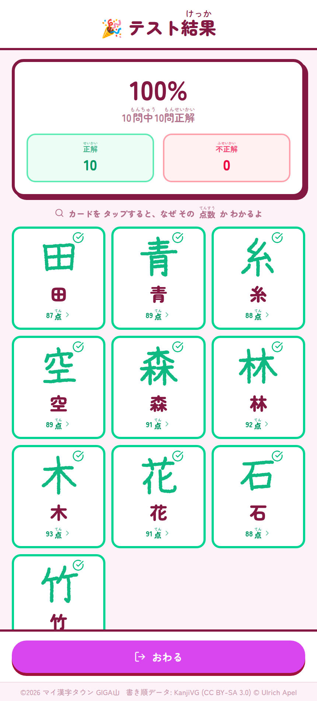

カードを押すと点数の内訳が開きます。

### リンクやQRコードで配る（Google Classroom）

一覧の「リンク」を押すと、配布用の画面が開きます。
別の教室や家庭にも渡せる、いちばん確実な方法です。

配布の手順:

1. 「リンク」を押してください。
2. 「URLをコピー」でアドレスを写すか、「Google Classroom で共有する」を押してください。
3. Classroom が開いたら、クラスと「課題」「資料」などを選んで投稿してください。
4. 児童の端末が近くにあるときは、画面の下のQRコードを読み取らせてもかまいません。

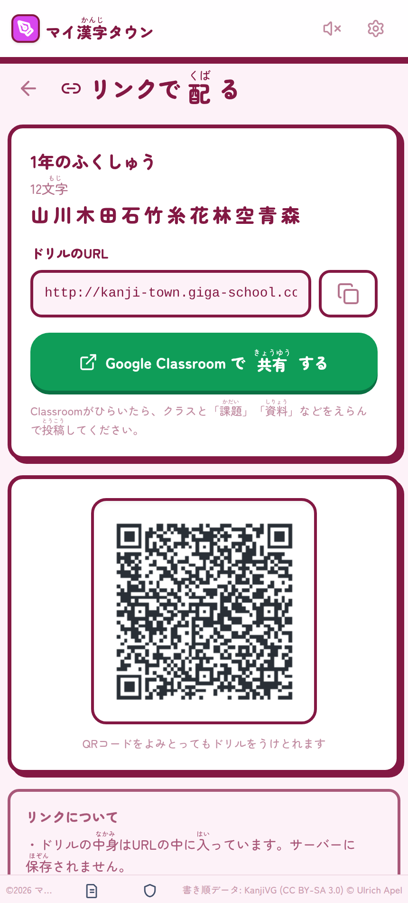

下にQRコードも表示されます。

【！】覚えておいていただきたいこと:

- ドリルの中身はURLそのものに入っています。サーバーには保存されません
- リンクを開いた児童は、そのまま自分のマイドリルに保存できます
- あとからドリルを直しても、配ったリンクは変わりません。新しいリンクを配りなおしてください
- URLは長くなります。短くしようとして途中で切らないでください。中身が失われます

### 4けたの数字で送る（同じ教室のとき）

同じ教室にいるときは、リンクを配らずに4けたの数字で渡せます。
「リンクで配る」の画面のいちばん下にある
「4けたのすうじで送る（同じ教室のとき）」から始めます。

送り方は、先生の画面に出た4けたの数字を児童に伝え、
児童が「通信でもらう」でその数字を入力する、という流れです。

児童の側の手順:

1. ホームの「通信でもらう」を押してください。
2. 「4けたのすうじをいれてね」と表示されます。数字のボタンで入力してください。
3. QRコードを読み取ってもかまいません。「QRコードでよみとる」から進みます。
4. 受け取ったドリルは、そのままマイドリルに保存できます。

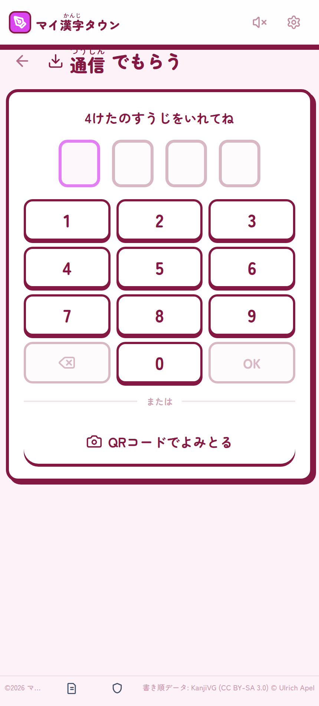

児童はこの画面で4けたを入力します。

【！】覚えておいていただきたいこと:

- この方法は、端末どうしを直接つなぐしくみを使います。学校のネットワークによっては使えません
- つながらないときは、上の「リンクやQRコードで配る」を使ってください。そちらは通信の制限を受けにくい方法です
- うまくいかないときの詳しい対処は、下の「うまく いかないとき」を見てください

## 学習の記録を ほかの端末へ移す（先生向け）

記録はその端末の中だけに保存されます。端末が変わると引き継がれません。
学年が上がるときや、端末を入れ替えるときは、この手順で移してください。

### 記録を書き出して読み込む

設定（画面右上のはぐるま）の「データ管理」から行います。
この欄には、いま使っている容量、覚えた漢字の数、学習中の漢字の数も表示されます。

移す手順:

1. 元の端末で設定を開き、「データ管理」まで画面を下げてください。
2. 「エクスポート」を押してください。日付の入ったファイルが1つ保存されます。
3. そのファイルを、新しい端末から開ける場所に置いてください。
4. 新しい端末で設定を開き、「インポート」を押してファイルを選んでください。
5. 確認の画面が出たら「実行する」を押してください。

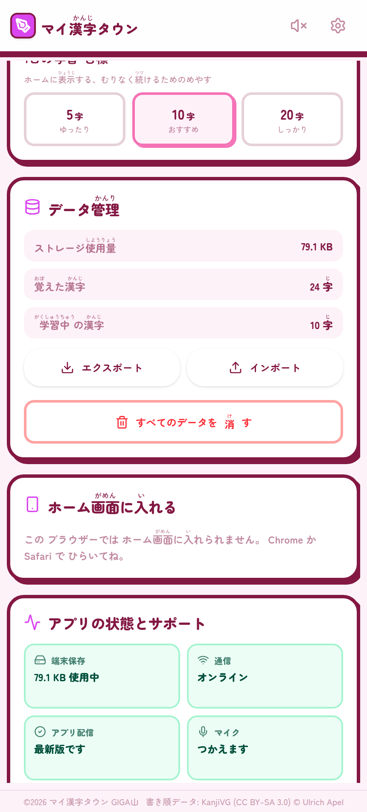

エクスポートとインポートはここにあります。

【！】覚えておいていただきたいこと:

- インポートすると、その端末の今の記録は上書きされます。先に元の端末で書き出しておいてください
- 書き出したファイルには氏名やメールアドレスは含まれません。学習の進み具合だけです
- ブラウザーの履歴やサイトデータを消すと、記録も一緒に消えます。学期の区切りで書き出しておくと安全です

### 【！！】すべてのデータを消す

同じ「データ管理」の下に「すべてのデータを消す」があります。
漢字の進み具合・まちのデータ・実績が、すべて消えます。

この操作は取り消せません。もとに戻す方法はありません。
実行する前に、かならず「エクスポート」で控えを取ってください。

共用の端末を次の学年に引き渡すときなど、本当に消してよいと判断したときだけ使ってください。
押すと確認の画面が出ます。やめるときは「やめる」を押してください。

## うまく いかないとき

こまったときは、この中から 近いものを さがしてください。
それでも なおらないときは、いちばん下を 見てください。

### <ruby>画面<rp>（</rp><rt>がめん</rt><rp>）</rp></ruby>が 白いまま／<ruby>表示<rp>（</rp><rt>ひょうじ</rt><rp>）</rp></ruby>が くずれている

<ruby>画面<rt>がめん</rt></ruby>を もう一度 よみこんでください。
ブラウザーの こうしんの ボタン、または キーボードの F5 です。

それでも なおらないときは、いちど タブを とじて、もう一度 ひらいてください。

### 「あたらしい バージョンが あります」と 出た

<ruby>画面<rt>がめん</rt></ruby>の 下に この おしらせが 出たら、よこの「さいしんに する」を
おしてください。すぐに 新しい ものに かわります。

<ruby>学習<rt>がくしゅう</rt></ruby>の とちゅうでも、<ruby>記録<rt>きろく</rt></ruby>は きえません。
急いでいるときは、そのまま つづけて、あとで おしても かまいません。

### <ruby>書<rp>（</rp><rt>か</rt><rp>）</rp></ruby>き<ruby>順<rp>（</rp><rt>じゅん</rt><rp>）</rp></ruby>の お手本（うすい字）が 出てこない

<ruby>書<rt>か</rt></ruby>き<ruby>順<rt>じゅん</rt></ruby>の データは、はじめて その字を 出すときに
インターネットから とりよせます。
学校の ネットワークで とめられていると、うすい字が 出ないことが あります。

先生や 学校の <ruby>情報担当<rt>じょうほうたんとう</rt></ruby>の先生に、つぎの アドレスを
<ruby>通<rt>とお</rt></ruby>してもらえるか きいてみてください。

- cdn.jsdelivr.net（書き順のデータ）
- fonts.googleapis.com と fonts.gstatic.com（文字の かたち）

一度 出た字は <ruby>端末<rt>たんまつ</rt></ruby>の 中に のこるので、2回目からは 早く 出ます。

### 4けたの <ruby>数字<rp>（</rp><rt>すうじ</rt><rp>）</rp></ruby>で <ruby>送<rp>（</rp><rt>おく</rt><rp>）</rp></ruby>れない／QRが 出ない

4けたの 数字で 送る しくみは、<ruby>端末<rt>たんまつ</rt></ruby>どうしを
<ruby>直接<rt>ちょくせつ</rt></ruby> つなぎます。
学校の ネットワークで とめられていると、下のように「エラーがおきました」と 出ます。

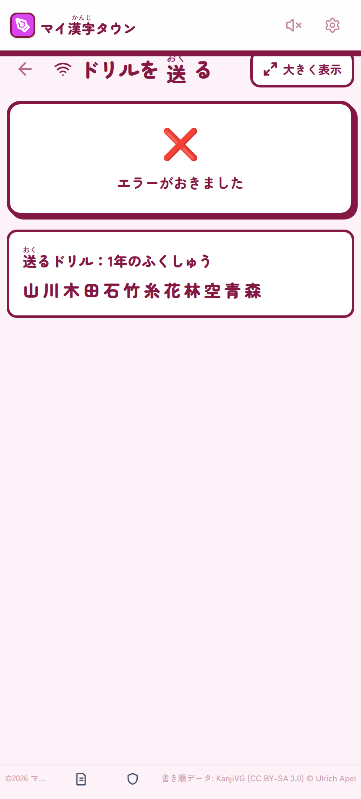

こう出たときは 下の やりかたを ためしてください。

このときは「リンクで<ruby>配<rt>くば</rt></ruby>る」を つかってください。
リンクと QRコードは、この しくみを つかわないので、<ruby>通<rt>とお</rt></ruby>りやすい
やりかたです。

QRコードだけが 出ないときは、下の アドレスも <ruby>通<rt>とお</rt></ruby>してもらってください。

- cdn.jsdelivr.net と unpkg.com（QRコードを 出す しくみ）

### <ruby>音読<rp>（</rp><rt>おんどく</rt><rp>）</rp></ruby>チャレンジで マイクが はんのうしない

はじめて つかうとき、ブラウザーが「マイクを つかっても いいですか」と きいてきます。
ここで「きょか」を えらばないと つかえません。

まちがえて ことわったときは、アドレスの よこの かぎの しるしから きょかしなおせます。
それでも だめなときは、せっていの「<ruby>音読<rt>おんどく</rt></ruby>チャレンジ」を
オフに してください。
オフでも <ruby>学習<rt>がくしゅう</rt></ruby>は さいごまで すすめられます。

<ruby>声<rt>こえ</rt></ruby>は ろくおんされません。どこにも <ruby>送<rt>おく</rt></ruby>られません。

### 字を <ruby>書<rp>（</rp><rt>か</rt><rp>）</rp></ruby>いても <ruby>線<rp>（</rp><rt>せん</rt><rp>）</rp></ruby>が 出ない

ゆびを ますの 中から はじめてください。ますの そとからは 書けません。
また、2本の ゆびが <ruby>画面<rt>がめん</rt></ruby>に ついていると 書けません。1本で 書いてください。

なぞる ときは、書きはじめの ばしょが 合っていないと <ruby>線<rt>せん</rt></ruby>が 出ません。
「かきはじめが ちがうよ」と 出たら、うすい字の はじまりの ところから 書きなおしてください。

### <ruby>記録<rp>（</rp><rt>きろく</rt><rp>）</rp></ruby>が きえてしまった

<ruby>記録<rt>きろく</rt></ruby>は その <ruby>端末<rt>たんまつ</rt></ruby>の 中だけに あります。
つぎの ときに 消えます。

- ブラウザーの りれきや サイトのデータを 消したとき
- ちがう <ruby>端末<rt>たんまつ</rt></ruby>や ちがう ブラウザーで ひらいたとき
- プライベートモード（シークレットモード）で ひらいたとき

消えた <ruby>記録<rt>きろく</rt></ruby>を もどす ほうほうは ありません。
先生に たのんで、ときどき「エクスポート」で ひかえを とっておくと あんしんです。

### <ruby>長<rp>（</rp><rt>なが</rt><rp>）</rp></ruby>い おやすみの あと、まちが あれている

こわれては いません。ながく ひらかないと、まちは わざと あれるように なっています。

<ruby>学習<rt>がくしゅう</rt></ruby>を すると、その場で くさは とれます。
へった 人や もどった <ruby>建物<rt>たてもの</rt></ruby>は、また
<ruby>学習<rt>がくしゅう</rt></ruby>を つづけると もどってきます。

### それでも なおらないとき

まず、この アプリを 教えてくれた 先生か、学校の
<ruby>情報担当<rt>じょうほうたんとう</rt></ruby>の先生に そうだんしてください。
同じ <ruby>端末<rt>たんまつ</rt></ruby>を つかっている ほかの人にも 同じことが 起きているかを 見ると、
<ruby>端末<rt>たんまつ</rt></ruby>の もんだいか、ネットワークの もんだいかが わかります。

先生が しらべるときは、せっていの いちばん下にある
「アプリの状態とサポート」を 見てください。
<ruby>端末<rt>たんまつ</rt></ruby>の ほぞん量、<ruby>通信<rt>つうしん</rt></ruby>の ようす、
アプリの <ruby>版<rt>はん</rt></ruby>、マイクが つかえるか、エラーの 回数が ならんでいます。

「診断ファイルを保存」を おすと、この ようすを 1つの ファイルに できます。
このファイルには、<ruby>漢字<rt>かんじ</rt></ruby>の <ruby>学習内容<rt>がくしゅうないよう</rt></ruby>・
<ruby>氏名<rt>しめい</rt></ruby>・メールアドレス・パスワードは 入りません。

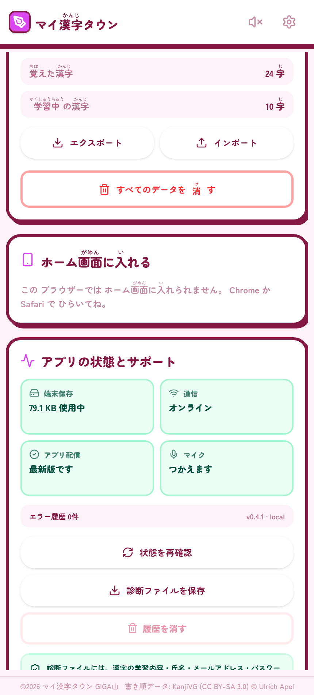

先生が しらべるときは ここを 見ます。

それでも わからないときは、このページの 下に ある 問い合わせ先へ ご連絡ください。
そのとき、上の 診断ファイルを 一緒に 送っていただけると、原因が 早く わかります。
