# 教室で使えるかもしれないもの作り #◯ 「一度合格したら、それで終わり」にしない。忘れたころに戻ってくる漢字学習アプリ「マイ漢字タウン」

## 🏫 はじめに

漢字のデジタルドリル、二学期の終わりごろには、もう開かれなくなっていた。そんなことはありませんか。合格したら終わりにせず、忘れたころにまた出てくる。そういう漢字の学習システムを作りたくて、マイ漢字タウンというアプリを作りました。

私が勤めている自治体では、教科の学習に使うデジタルドリルを、まとめて導入しています。漢字のドリルもその中に入っていて、子どもたちは自分の端末からいつでも取り組めます。中身はよくできています。字形も、書きはじめも書き終わりも、とめやはねも、筆順まで見て採点してくれます。自治体が認めたドリルというだけあって、機能としては非常に完成度が高いものが十分にそろっています。

それでも、気になっていたことが二つありました。

一つは、採点が厳しいことです。ていねいに書いたつもりの字が何度も戻ってくると、子どもは学習に前向きになれません。

もう一つは、一度合格した字をもう一度学び直す道が、アプリの側に用意されていないことです。合格したら、それで終わりでした。

はじめのうちは、みんな一生懸命に取り組みます。ただ、一学期、二学期、三学期と進み、学年が上がるにつれて、だんだん開かれなくなっていく。私はそれを何度も見てきました。

漢字は、一度書けたら身についた、とはならない学習です。忘れたころにもう一度出てきて、また書く。それを徹底的に繰り返すうちに、やっと自分のものになります。その「もう一度」を、アプリの側から持ってくることにしました。

とはいえ、繰り返しはつまらないものです。だから、漢字を進めるほど楽しい遊びができるようにしました。そのかわり、遊びだけのアプリにならないよう、漢字が身につくかどうかは最後まで譲らないと決めて作りました。

https://kanji-town.giga-school.com/

アカウントもログインもいりません。URLを開けば、その場で始められます。学習の記録は、その端末のなかだけに残ります。

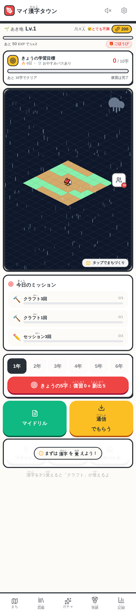

トップページ。学年を選んで、赤いボタンを押せばその日の学習が始まります。

## 📱 このアプリでできること

小学校で習う教育漢字1,026字を、すべて収めています。1年生の80字、2年生の160字、3年生の200字、4年生の220字、5年生の185字、6年生の181字。2020年に改訂された学年別漢字配当表のとおりです。

1字の学習は4つに分けました。まず読めること。次にお手本を見ること。それからなぞり書き。最後に、自分の力で書くことです。順番には理由があります。読めない字を書かせても、線の形をまねているだけになってしまうからです。

最初は音読です。その漢字を使った例文が出てきます。例文はアプリ全体で2,033あります。読みかたと意味を、書く前に頭に入れておくためのステップです。

音読の画面。例文を読んで、読みと意味をつかんでから書きはじめます。

ここには音読チャレンジという任意の課題をつけました。マイクのボタンを押して、しっかり声が出ていればクリアになり、ボーナスの経験値がもらえます。

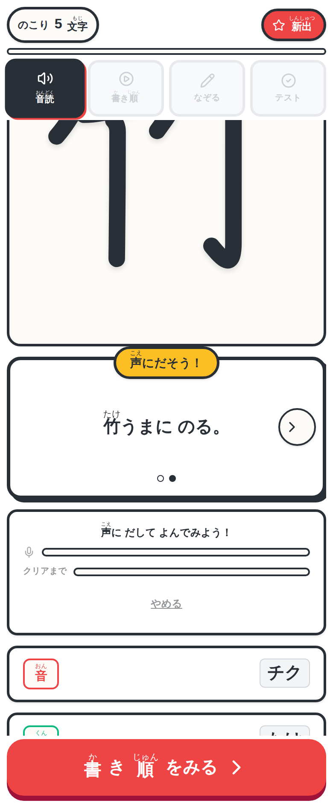

マイクのボタンを押して、例文を声に出して読みます。

声が届くとクリアになり、ボーナスの経験値がつきます。

声は録音していません。保存もしていませんし、どこにも送っていません。アプリが見ているのは、いま音が出ているかどうかの大きさだけです。判定が終わるとマイクはすぐに手放します。読みかたが合っているかどうかまでは見ていません。声を出して読んだ、という行動そのものを支えるための課題です。マイクが使えない端末では案内表示に変わり、学習はそのまま最後まで進められます。

次にお手本を見ます。一画ずつ、番号つきで動きます。ここで使っている字の形はKanjiVGという書き順のデータをもとにしていて、読むときに見た字、なぞる手本、採点に使う手本が、すべて同じ形にそろえてあります。

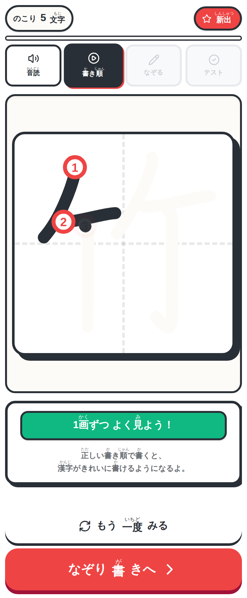

書き順のお手本。何度でも見返せます。自動で流すこともできます。

そのあとがなぞり書きです。回数を重ねると、手本が少しずつ引いていきます。1回目と2回目は線に吸いつくなぞり書き、3回目から5回目は手本がうすく残る手書き、6回目からは手本のない空書きです。同じ字を書きながら、支えだけが減っていきます。急に一人にしないための段階です。

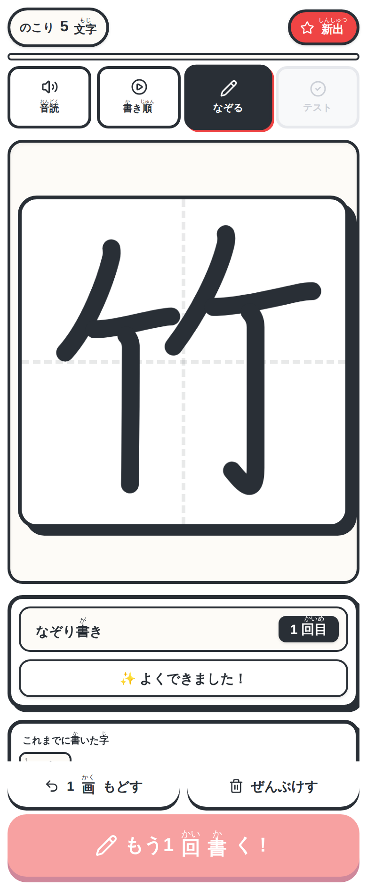

1回目と2回目は線に吸いつくので、形をくずさずに運筆の感覚をつかめます。

最後がテストです。手本のないマスに、自分の力で書きます。マスは画面の高さに合わせていちばん大きく取れる大きさに変わるので、指でもタッチペンでも無理なく書けると思います。

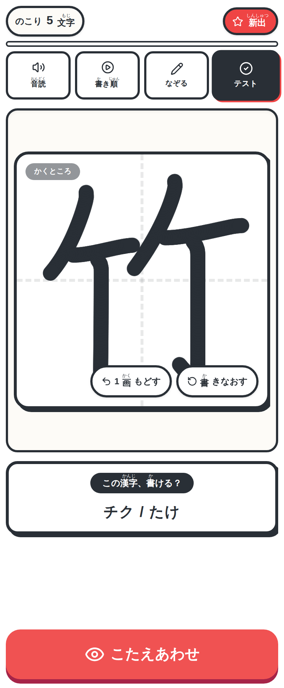

手本はもう出ません。ここで書けて、はじめて身についたことになります。

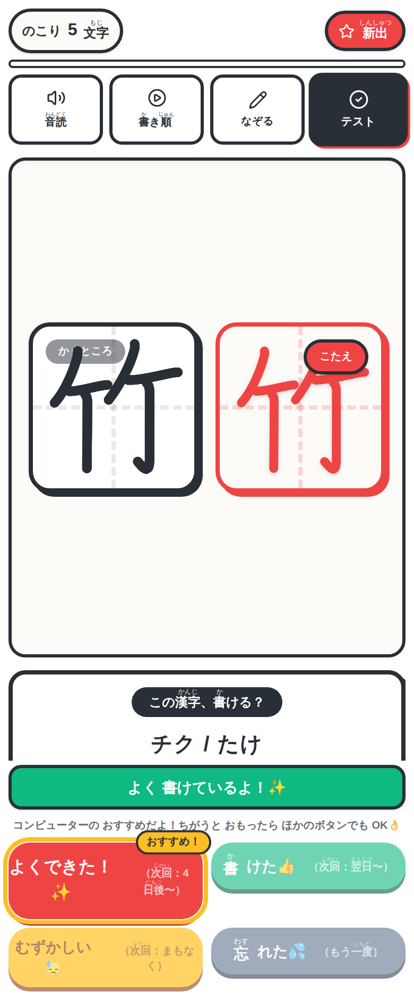

自分の字とこたえが並びます。この結果を見て、次にいつ復習するかが決まります。

覚えた漢字は、町の住民としてマップに増えていきます。学習を続けるとレベルが上がり、探索できる範囲が広がって、集めた素材で建物を作れるようになります。ここが、漢字の学習と遊びをつなげたところです。学習を進めた結果として町が育つので、遊びたければ漢字をやることになります。

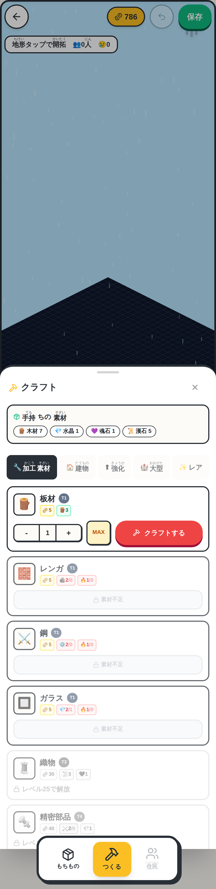

学習中に集まった素材で、85種のレシピから建物や加工素材を作れます。

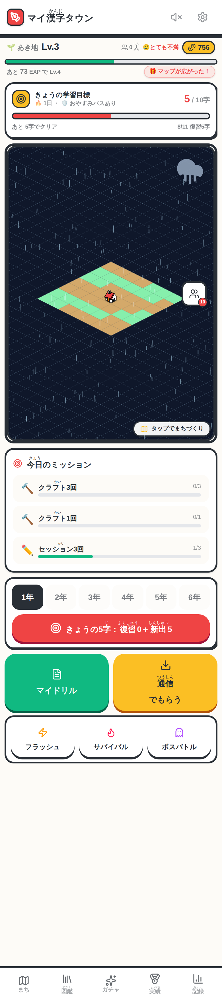

学習した日のトップページ。土地が広がり、レベルが上がりました。

## 🔁 一度合格して、終わりにしない

ここが、このアプリでいちばん作りたかったところです。

テストに答えると、その字の次の出番が決まります。すらすら書けた字は間隔が伸びていき、あやふやだった字はすぐに戻ってきます。最初は1分後、次が10分後、そこを抜けると1日後。そこから先は、その子にとってその字がどれだけ易しいかに応じて、間隔が伸びていきます。

だから、合格したら消えるということが起きません。忘れそうなころに、また出てきます。

そのことを、子どもにも分かる形にしました。復習の期限が来ると、町にお化けが出ます。学習すればいなくなります。今日やることを言葉で説明するかわりに、町の様子で伝えています。「復習しなさい！」とアプリにまで言われてしまっては、子どもも滅入ってしまいますからね。

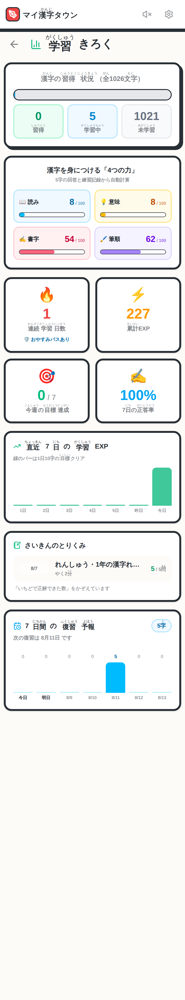

これから7日間、いつ何字ぶんの復習が来るかが出ます。予定が見えると身構えずに済みます。

戻ってきた字を、また4段階の最初からやり直すわけではありません。読み、意味、書字、筆順の4つの力を、それぞれ0から100までの点で別々に記録していて、その字に足りていない段階から始まります。読めるけれど書けない字は書くところから、形は取れるけれど書き順があやしい字はお手本を見るところから。同じ「復習」でも、子どもによって中身が変わります。

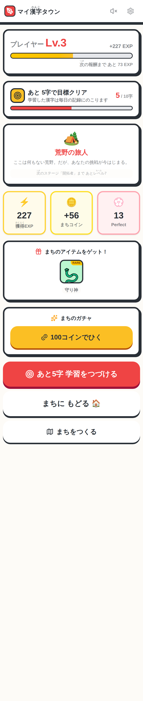

もらった経験値とコイン。そして町の物語が、レベルに合わせて進みます。

まちがいの多い字だけを10字集めて戦うボスバトルも用意しました。負けても報酬は半分もらえて、失敗した字はすぐ復習に戻ります。全部できないと何ももらえない作りにすると、苦手な字から遠ざかってしまうと思ったからです。

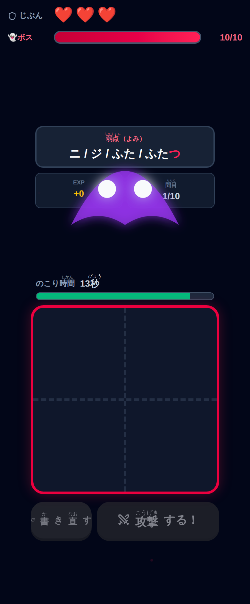

苦手な字ほど出てきます。ここで落とした字は、そのまま次の復習に並びます。

## ✍️ 厳しすぎない、でも甘くない採点

採点には時間をかけました。厳しすぎて前を向けなくなるのも、甘くて身につかないのも、どちらも避けたかったからです。

100点を6つの採点基準に分けています。字の形が30点、書き順が25点、とめ・はね・はらいが15点、点画の交わりかたが10点、書きはじめの位置が10点、書きおわりの位置が10点です。合格は70点にしました。

そして、その内訳を子どもに見せます。採点されたカードをタップすると、自分の書いた字と手本が番号つきで並び、どの項目で何点だったかが出てきます。

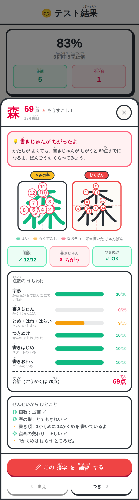

字の形は30点満点。でも書き順が3点。何画目をどう書いたかまで出ます。

この画面は、わざと書き順を入れかえて書いたときのものです。字の形は満点、とめ・はね・はらいも満点、点画の交わりも正しい。それでも合計は69点で不合格になります。書き順に誤りがあるときは、69点より上に行かないようにしてあるからです。

なぜそんな上限を設けたのか、少し説明させてください。たとえば「三」という字は、下から書いても見た目はまったく同じになります。形だけを見る採点だと、これは満点です。上限を作らないと、書き順の誤りが点数にまったく表れません。それでは書き順を身につける役に立たないので、形が完璧でも合格させない、という線を引きました。

ただし0点にはしません。どこがどう違ったのかを、点数と講評に残します。0点にするのは画数そのものが違うときだけです。別の字になってしまっているので、そこは部分点を出しません。それ以外は、できたところの点を残します。全部だめだと言われると、次の一字を書く気持ちがなくなってしまうからです。

点画の交わりかたは、突き抜けた長さで見ています。「土」のようにT字に接するだけの画と、「牛」のように突き抜ける画は、区別しなければなりません。線が何回交差したかを数える方法だと、ゆっくり書けば交差と判定されやすく、速く書けば判定されにくい、という書く速さ次第の採点になってしまいます。

とめ・はね・はらいについては、ひとつ決めごとをしました。正解が分からないときは褒めない、というものです。以前は子どもの書いた終筆をそのまま読み取って「きれいなハネ」などと返していたのですが、これだと、とめるべきところではねても褒めてしまうことがありました。誤りをこちらから強化していたことになります。いまは手本の側に筆画の種類の情報があるときだけ判定し、分からないときは中立の言葉を返します。

この項目の配点をあえて15点と控えめにして、外れても半分の点が残るようにしたのは、文部科学省の「常用漢字表の字体・字形に関する指針」が、終筆の細かい部分にある程度の幅を認めているためです。細部を厳しくしすぎて、書くこと自体を怖がらせたくありませんでした。

判定できない項目が出たときは、その配点を残りの項目に配り直します。正しく書けていれば、いつでも100点になります。採点の仕組みは、ふだんの学習でも、ドリルのテストでも、ボスバトルでも、まったく同じものを使っています。画面によって基準が変わることはありません。

## ✨ 導入のメリット

三つのいいことが期待できます。

一つ目は、先生に見えなかったところが見えるようになることです。ノートに残るのは書き上がった字だけですが、このアプリは書いている途中の運びを見ています。字の形はいいのに書き順でつまずいている子、はらうところで止めてしまう子を、答案からではなく、その場で見分けられます。そして子ども自身が、なぜ69点なのかを画面で確かめられます。先生が一人ずつ説明して回らなくても、直すべきところが本人に届きます。

二つ目は、丸付けの時間が減ることです。字形と書き順の細かい判定はアプリが引き受けます。そのぶん先生は、この字のはねが力強くなったね、住民がこんなに増えたね、といった数字にならない伸びを言葉にすることに、時間を使えるのではないかと思います。

三つ目は、学び方の選択肢が増えることです。今日は鉛筆でノートに向かいたい。今日は集中が切れそうだから、町を育てながら頑張りたい。そんなふうに、その日の調子で手段を選べるようになります。ノートにはノートの良さがありますし、これを置きかえるつもりはありません。

紙のドリルの代わりになろうとは思っていません。学校では教材会社の漢字ドリルと漢字ドリルノートを使って、教科書に出てくる順で進めていく学校が多いはずです。その進みかたに寄り添えるように作りました。どの字を、どの方法でやるか。そこまで子どもが自分で決められるようになったら、選べる状態を作った意味があるのだと思います。

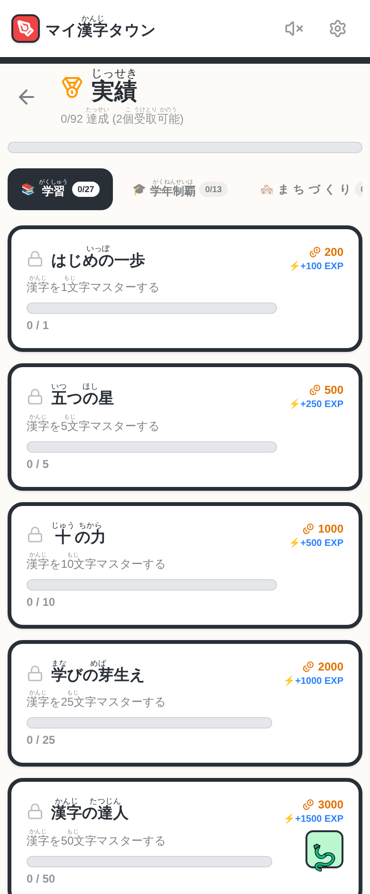

実績は92種類。集めるとコインや建物がもらえます。続ける理由はいくつあってもいいと思っています。

## 🛠️ 【管理者向け】導入手順

情報担当の先生に確認されそうなことを、先にまとめておきます。

導入の作業は、URLを子どもたちに伝えるだけです。インストールも、アカウントの登録もいりません。

https://kanji-town.giga-school.com/

個人情報については、氏名も出席番号もメールアドレスも、入力する場所自体がありません。学習の記録が残るのは、使った端末のなかだけです。外に送ることはしていません。以前はクラウドに記録を預ける仕組みを持っていましたが、これは取りやめました。音読チャレンジの声も、録音・保存・送信を一切しません。ドリルの受けわたしも、サーバーを通しません。

校内のフィルタリングで許可が必要になりそうなアドレスは二つあります。一つめは cdn.jsdelivr.net です。書き順の手本データと、ドリルを配るときのQRコードを、ここから取り込んでいます。止まっていると、うすい手本とQRコードが出ません。一度取り込めば端末に残るので、次からはつながっていなくても表示されます。二つめは fonts.googleapis.com で、画面の書体です。止まっていても端末の書体で代わりに表示されるので、学習に支障はありません。

インターネットは、最初の1回だけつながっていれば大丈夫です。ホーム画面に追加しておくと、アプリのように1タップで開けるようになり、つながっていない場所でも起動します。学習の記録も消えにくくなるので、続けて使う場合は追加をおすすめします。

iPadとiPhoneについては、ひとつだけ気をつけていただきたい点があります。Safariの仕様で、7日間まったく開かないと保存した記録が自動で消えることがあります。ホーム画面に追加しておくと起きにくくなりますが、長期休業をはさむときは、休みに入る前に記録の書き出しをしておくと安心です。設定の中に、記録をファイルに書き出す機能と、別の端末で読み込む機能があります。学年が上がって端末を入れ替えるときも、この二つで引き継げます。

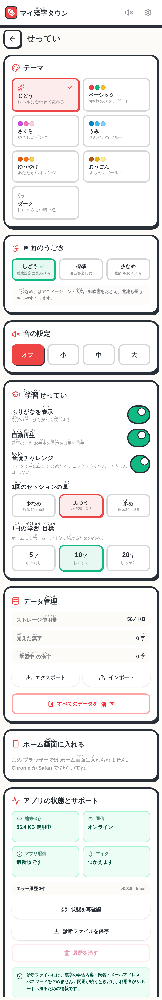

配色、動きの量、ふりがな、1回に学ぶ字数などを変えられます。書き出しと読み込みもここです。

うまく動かないときのために、端末の状態と最近のエラーを表示する画面も用意しました。設定の下のほうにあります。この画面を見せていただければ、原因が分かりやすくなります。ここにも個人情報は含まれません。

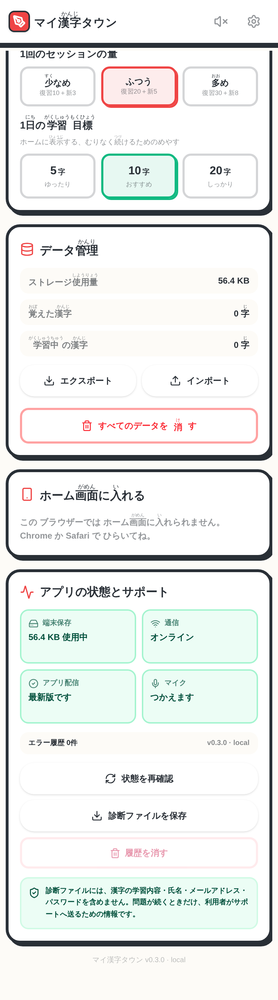

保存できているか、オフラインで使えるかなどが一目で分かります。

先生向けの手引きは MANUAL.md として別に用意しました。専門用語を使わずに書いてあります。

## 📖 【利用者向け】使い方のガイド

### はじめて使う日

1. 子どもの端末で上のURLを開きます。
2. 最初に案内が出ます。「つぎへ」で読み進めるか、時間がなければ「スキップする」で飛ばせます。
3. 学年を選びます。
4. 赤い「きょうの5字」を押すと、その日の学習が始まります。

1日10字が目安で、10分から15分ほどで終わります。量は設定で変えられます。1字ごとに、音読、お手本、なぞり書き、テストの順に進みます。

### 紙のドリルと一緒に使う

学校では、教材会社の漢字ドリルと漢字ドリルノートを使って、教科書に出てくる順で漢字を進めていくことが多いと思います。このアプリは学年別漢字配当表の順に並んでいるので、そのままでは教科書の順とそろいません。

そこで、覚えたい漢字だけを選んで、自分でまとまりを作れるようにしました。今週のドリルで出てくる5字だけを集める。一学期に間違いが多かった字を集める。そういう使いかたです。学年をまたいで選べます。紙のドリルを使った学習の、良き伴走者になれたらと思って作った部分です。

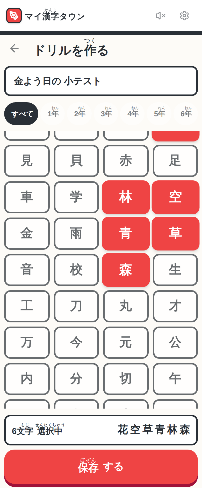

学年の枠をこえて、覚えさせたい字だけを選べます。

作れるのは先生だけではありません。子どもが自分で、覚えていない字を集めたまとまりを作ることもできます。テストが返ってきたあとに、書けなかった字だけを集めて練習する。そういう進め方ができます。

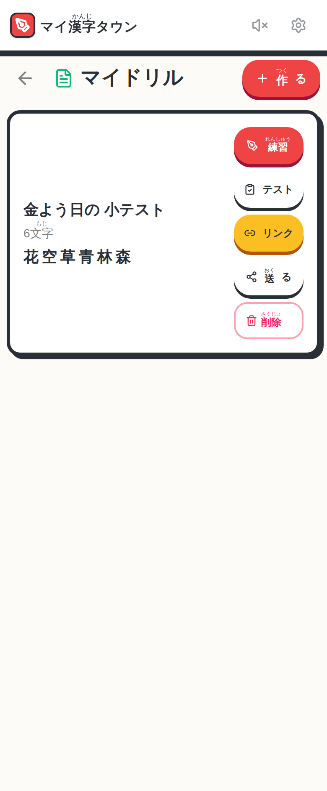

作ったドリルは、練習にもテストにも使えますし、そのまま配れます。

### 先生がドリルを配る

配り方は2通りあります。よく使うのはリンクで配る方法です。

1. マイドリルの一覧で、配りたいドリルの「リンク」を押します。
2. 「Google Classroom で共有する」を押すか、URLをコピーします。
3. コピーしたURLは、Classroomの課題や資料、学級だよりに貼りつけられます。
4. 子どもはそのリンクを開くだけで受け取れます。

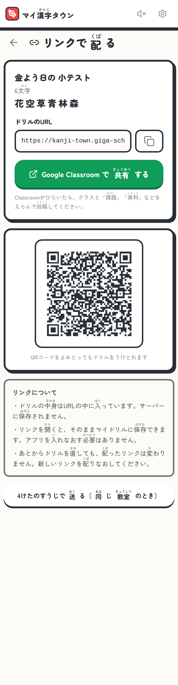

ドリルの中身はURLの中に全部入っています。どこかのサーバーに保存されることはありません。

この方法だと、同じ教室にいなくても配れます。家庭学習にも使えますし、学級閉鎖のときにも届きます。アカウントの連携も、外部のサービスとのやりとりの設定もいりません。Classroomの共有画面を開くだけの作りにしてあるからです。

気をつけていただきたいのは、配ったあとにドリルを直しても、配り済みのリンクの中身は変わらないことです。直したら、リンクを配りなおしてください。それと、漢字を入れすぎるとURLが長くなりすぎます。長すぎる場合は画面が知らせてくれるので、そのときはドリルを分けてください。

もう1つは、4けたの数字で送る方法です。同じ教室にある端末どうしを直接つなぎます。先生の端末に4けたの数字とQRコードが出るので、子どもはそれを入れるか読み取るだけです。電子黒板に映すときは「大きく表示」を押すと文字が1.5倍になり、教室の後ろの席からも読めます。

### ドリルでテストする

1. マイドリルの一覧で「テスト」を押します。
2. 何問出すかを選びます。ドリルの字を全部出すか、10問、20問、50問、100問のうち、字数が足りているものから選べます。
3. 例文の中の「◯」のところに、その漢字を書きます。
4. 「答える」を押すと、次の問題に進みます。
5. 全部書き終えると、まとめて採点されて結果が出ます。

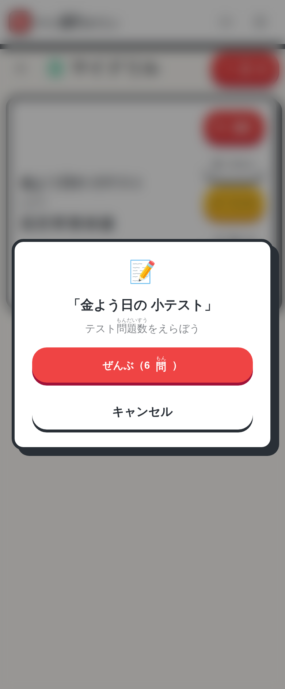

全6字のドリルなので、ここに出るのは全部の6問だけです。字数が増えると選べる数も増えます。

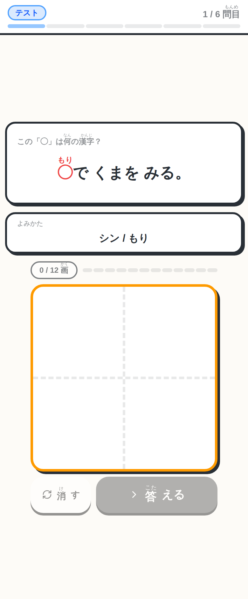

一文字を切りはなして書くのではなく、例文の流れの中で書きます。

一問ごとに止まらないので、テストらしい緊張感のまま最後まで走り抜けられます。結果の画面では、点数のついたカードが並びます。カードを押すと、さきほどの採点の内訳が開きます。

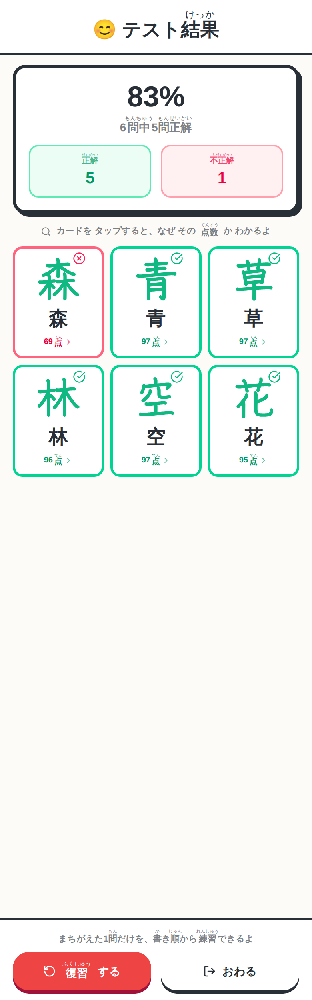

「復習する」を押すと、まちがえた問題だけを学習しなおせます。

漢字テストの前の練習に使うこともできますし、どの字を覚えていないか確かめるために先にテストだけをすることもできます。結果を見てから、足りないところを補うように学習を選ぶ。そこまで自分で決められるようにしてあります。

覚えていない字が分からないときは、漢字ずかんから探せます。1026字を学年、漢字、読みで探せて、選んだ1字だけの練習もその場で始められます。

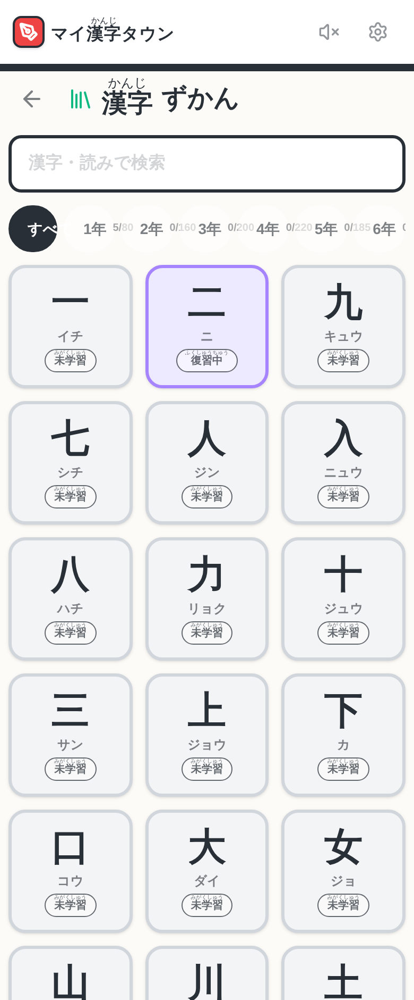

学年ごとの習得数が出ます。気になった1字だけを、その場で練習できます。

## 📝 まとめ

漢字の練習は、どうしても反復から逃げられません。逃げられないからこそ、一度合格して終わりにするのはもったいないと思っていました。

合格した字が消えてしまうと、そこで学習も止まります。忘れたころにまた出てくるなら、開き続ける理由が残ります。そして、開き続けた結果として町が育つなら、続けること自体が少し楽しくなるはずです。そう思って作りました。

細かい判定をアプリが引き受けるぶん、先生の手には時間が残ります。その時間で、点数には出てこない伸びを見つけて、言葉にしてあげてほしいと思っています。ICTを使うことで生まれる、子どもと向き合う時間のゆとり。そのゆとりこそが、教育の質を高めるのだと私は信じています。

これまでのノートやドリルも大切にしながら、三つ目の選択肢としてこのアプリを添えてみてください。今日はどっちで頑張る、という問いかけが、子どもたちが自分で学びを動かしはじめる一歩になるはずです。

もし授業や家庭学習で使ってみた感想があれば、コメントなどで教えていただけると嬉しいです。現場の先生方の声が、この町をより良くしていく一番の材料になります。

一歩踏み出そうとする先生を、私はいつでも全力で応援しています。

https://kanji-town.giga-school.com/

## 🏷 ハッシュタグ

#小学校 #小学校教員 #国語 #漢字 #音読 #GIGAスクール #ICT教育 #1人1台端末 #個別最適な学び #授業づくり #家庭学習 #タブレット学習 #iPad #Chromebook #マイ漢字タウン
